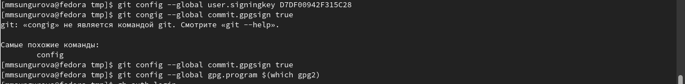

---
## Front matter
title: "Лабораторная работа №2"
subtitle: "Управление версиями"
author: "Сунгурова Мариян Мухсиновна"

## Generic otions
lang: ru-RU
toc-title: "Содержание"

## Bibliography
bibliography: bib/cite.bib
csl: pandoc/csl/gost-r-7-0-5-2008-numeric.csl

## Pdf output format
toc: true # Table of contents
toc-depth: 2
lof: true # List of figures
lot: false # List of tables
fontsize: 12pt
linestretch: 1.5
papersize: a4
documentclass: scrreprt
## I18n polyglossia
polyglossia-lang:
  name: russian
  options:
	- spelling=modern
	- babelshorthands=true
polyglossia-otherlangs:
  name: english
## I18n babel
babel-lang: russian
babel-otherlangs: english
## Fonts
mainfont: PT Serif
romanfont: PT Serif
sansfont: PT Sans
monofont: PT Mono
mainfontoptions: Ligatures=TeX
romanfontoptions: Ligatures=TeX
sansfontoptions: Ligatures=TeX,Scale=MatchLowercase
monofontoptions: Scale=MatchLowercase,Scale=0.9
## Biblatex
biblatex: true
biblio-style: "gost-numeric"
biblatexoptions:
  - parentracker=true
  - backend=biber
  - hyperref=auto
  - language=auto
  - autolang=other*
  - citestyle=gost-numeric
## Pandoc-crossref LaTeX customization
figureTitle: "Рис."
tableTitle: "Таблица"
listingTitle: "Листинг"
lofTitle: "Список иллюстраций"
lotTitle: "Список таблиц"
lolTitle: "Листинги"
## Misc options
indent: true
header-includes:
  - \usepackage{indentfirst}
  - \usepackage{float} # keep figures where there are in the text
  - \floatplacement{figure}{H} # keep figures where there are in the text
---

# Цель работы

Изучить идеологию и применение средств контроля версий.–Освоить умения по работе с git.

# Задание

-Создать базовую конфигурацию для работы с git.
–Создать ключSSH.–Создать ключPGP.
–Настроить подписи git.
–Зарегистрироваться наGithub.
–Создатьлокальный каталогдля выполнения заданий по предмету.

# Теоретическое введение
Системы контроля версий (Version Control System,VCS)применяются при работе нескольких человек над одним проектом.Обычно основное дерево проекта хранится в локальном или удалённом репозитории,к которому настроен доступ для участников проекта.Привнесении изменений в содержание проекта система контроля версий позволяет ихфиксировать, совмещать изменения, произведённые разными участниками проекта,производить откат к любой более ранней версии проекта,если этотребуется.В классических системах контроля версий используется централизованная модель,предполагающая наличие единого репозитория для хранения файлов.Выполнение боль-шинства функций по управлению версиями осуществляется специальным сервером.Участник проекта (пользователь) перед началом работы посредством определённыхкоманд получает нужную ему версию файлов.После внесения изменений,пользовательразмещает новую версию в хранилище. При этом предыдущие версии не удаляютсяиз центрального хранилища и к ним можно вернуться в любой момент.Сервер может сохранять неполную версию изменённых файлов,а производить так называемую дельта-компрессию—сохранятьтолько изменения между последовательными версиями,что позволяет уменьшить объём хранимых данных.Системы контроля версий поддерживаютвозможность отслеживания и разрешенияконфликтов, которые могут возникнуть при работе нескольких человек над однимфайлом.Можно объединить (слить) изменения,сделанные разными участниками (авто-матически или вручную),вручную выбрать нужную версию,отменить изменения вовсеили заблокировать файлы для изменения. В зависимости от настроек блокировка непозволяетдругим пользователям получитьрабочую копию или препятствуетизменениюрабочей копии файла средствами файловой системы ОС,обеспечиваятаким образом,привилегированный доступтолько одному пользователю,работающему с файлом.Системы контроля версийтакже могутобеспечиватьдополнительные,более гибкиефункциональные возможности.Например,они могут поддерживать работу с нескольки-ми версиями одного файла,сохраняя общую историю изменений до точки ветвленияверсий и собственные истории изменений каждой ветви.Крометого,обычно доступнаинформация отом,кто из участников,когда и какие изменения вносил.Обычнотакогорода информация хранится в журнале изменений,доступ к которому можно ограничить.В отличие от классических,в распределённых системах контроля версий центральныйрепозиторий не является обязательным.Среди классических VCS наиболее известны CVS, Subversion, а среди распределён-ных — Git, Bazaar, Mercurial. Принципы их работы схожи, отличаются они в основномсинтаксисом используемых в работе команд.

# Выполнение лабораторной работы

1. Создала учётную запись на https://github.com. Заполнила основные данные на https://github.com.  (рис. [-@fig:001])

{ #fig:001 width=70% }

2. Установила git-flow в Fedora Linux  (рис. [-@fig:002])

{ #fig:002 width=70% }

3. Установила gh в Fedora Linux  (рис. [-@fig:003])

{ #fig:003 width=70% }

4. Произвела базовую настройку git  (рис. [-@fig:004])

{ #fig:004 width=70% }

5. Создала ключ ssh по алгоритму rsa размером 4096 мб (рис. [-@fig:005])

{ #fig:005 width=70% }

6. Создала ключ по алгоритму ed25519 (рис. [-@fig:006])

{ #fig:006 width=70% }

7. Создала ключи pgp. (рис. [-@fig:007])

{ #fig:007 width=70% }

Из предложенных опций выбрала:
 – тип RSA and RSA;
 – размер 4096;
 – выбрала срок действия по умолчанию— 0 (срок действия не истекает никогда).
– Имя.
 – Адрес электронной почты. 
 
8. Добавила PGP ключ в GitHub (рис. [-@fig:008  , -@fig:009])

{ #fig:008 width=70% }

{ #fig:009 width=70% }

9. Перешла в настройки GitHub (https://github.com/settings/keys), нажала на кнопку New GPG key и вставила полученный ключ в поле ввода.(рис. [-@fig:010])

{ #fig:010 width=70% }

10. Произвела настройку автоматических подписей коммитов git (рис. [-@fig:011])

{ #fig:011 width=70% }

11. Настроила gh (рис. [-@fig:012])

{ #fig:012 width=70% }

12. Создала репозиторий курса на основе шаблона (рис. [-@fig:013  , -@fig:014])

{ #fig:013 width=70% }

{ #fig:014 width=70% }

13. Настроила  каталог курса  (рис. [-@fig:015 , -@fig:016])

{ #fig:015 width=70% }

{ #fig:016 width=70% }

# Выводы

В этой лабораторной работе я научилась работать с git и подключать удаленные репозитории, добавлять и удалять необходимые файлы. Я также научилась использовать Git Flow, который значительно упрощает разработку проекта и навигацию между ветвями.

#Ответы на контрольные вопросы

    1. Системы контроля версий -VCS- это программное обеспечение, которое используется для облегчения работы с изменяющейся информацией, обычно - в проектах. Чаще всего используется при разработке, когда над одним проектом работает большое количество людей. 2.
    • Репозиторий в системе контроля версий - Это удаленный репозиторий, в котором хранятся все файлы проекта
    • commit - фиксирует изменения перед загрузкой файлов в систему контроля версий
    • история хранит все изменения в проекте, и при необходимости позволяет откатиться в желаемое место
    • рабочая копия - - это копия проекта на компьютере разработчика. Если другой член команды изменил проект, вам необходимо скачать новую версию проекта на свой компьютер.
    3. В отличие от классических, в распределённых системах контроля версий центральный репозиторий не является обязательным. Среди классических VCS наиболее известны CVS, Subversion, а среди распределённых — Git, Bazaar, Mercurial. Принципы их работы схожи, отличаются они в основном синтаксисом используемых в работе команд. В децентрализованных системах у каждого из участников проекта есть полная копия проекта на своем компьютере, что делает его менее зависимым от сервера (Git).
    4. Для начала необходимо создать и подключить удаленный репозиторий. Затем, поскольку никто, кроме вас, не изменяет проект, по мере изменения проекта отправляйте изменения на сервер, и нет необходимости загружать изменения.
    5. Участник проекта (пользователь) перед началом работы посредством определённых команд получает нужную ему версию файлов. После внесения изменений, пользователь размещает новую версию в хранилище. При этом предыдущие версии не удаляются из центрального хранилища и к ним можно вернуться в любой момент.
    6. Упрощение обмена информацией, ускорение разработки, устранение ошибок и недочетов при разработке. 7.
    • git init - инициализирует локальный репозиторий
    • git add * или add. - добавляет файлы в репозиторий
    • git commit - версия фиксации
    • git pull - загружает текущую версию проекта
    • git push - отправляет измененный проект на сервер
    • git checkout - позволяет переключаться между ветками
    • git status - текущий статус проекта
    • git branch - просмотреть доступные ветки
    • git remote add - добавить удаленный репозиторий
    8. git push --all (push origin master/любой branch)
    9. Ветви функций, также иногда называемые ветвями тем, используются для разработки новых функций, которые должны появиться в текущих или будущих выпусках.
    10. Существуют временные и системные файлы, которые загромождают проект и не нужны. путь к ним можно добавить в файл .gitignore, тогда они не будут добавлены в проект[@gnu-doc:bash;@tannenbaum:arch-pc:ru;@tannenbaum:modern-os:ru]

# Список литературы{.unnumbered}

::: {#refs}
:::
