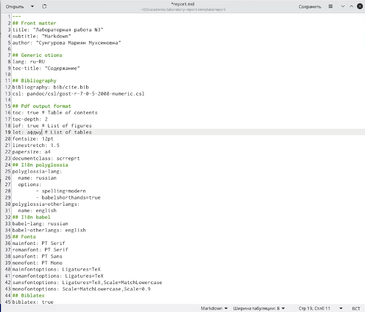
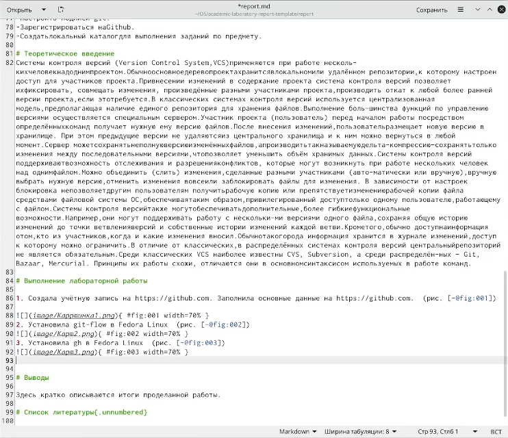
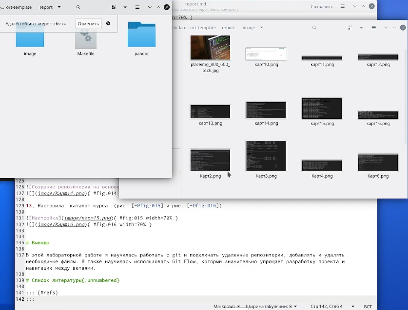
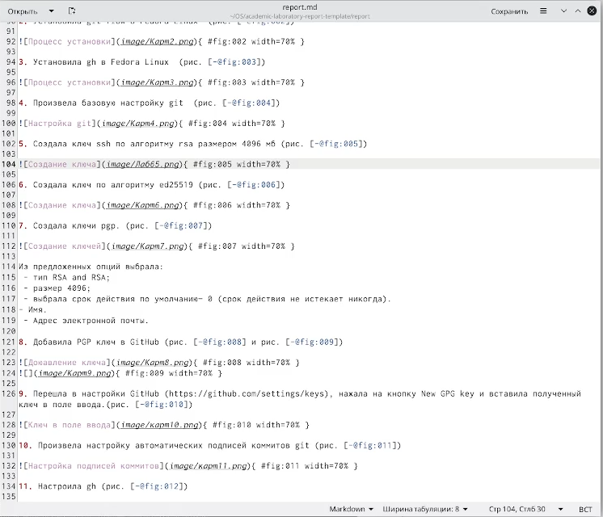
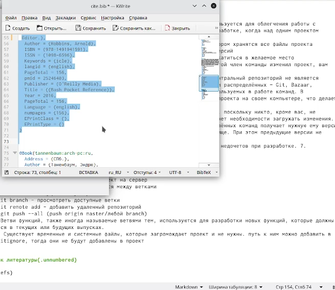

---
## Front matter
lang: ru-RU
title: Лабораторная работа №3
author: |
	Сунгурова Мариян Мухсиновна, НКНбд-01-21
	

## Formatting
toc: false
slide_level: 2
theme: metropolis
header-includes: 
 - \metroset{progressbar=frametitle,sectionpage=progressbar,numbering=fraction}
 - '\makeatletter'
 - '\beamer@ignorenonframefalse'
 - '\makeatother'
aspectratio: 43
section-titles: true
---

## Содержание
1. Цель работы
2. Процесс выполнения
3. Вывод
4. Источники

## Цель работы

Научиться оформлять отчёты с помощью легковесного языка разметки Markdown.

## Процесс выполнения

1. Приступила к редактированию файла report.md  (рис. [-@fig:001])

{ #fig:001 width=70% }

## Процесс выполнения

2. Теоретическое введение (рис. [-@fig:002])

{ #fig:002 width=70% }

## Процесс выполнения

3.  Создание ссылок на фото из папки images (рис. [-@fig:003])

{ #fig:003 width=70% }

## Процесс выполнения

4. Описала шаги, прикрепив фото  (рис. [-@fig:004])

{ #fig:004 width=70% }

## Процесс выполнения

5. Описала источники (рис. [-@fig:005])

{ #fig:005 width=70% }

## Вывод
В этой лабораторной работе я научилась оформлять отчеты при помощи легковесного языка разметки Markdown, работать с фото и bib файлами для источников.

## ИСточники

1. КулябовД. С. Введение в операционные системы –Лекция;

