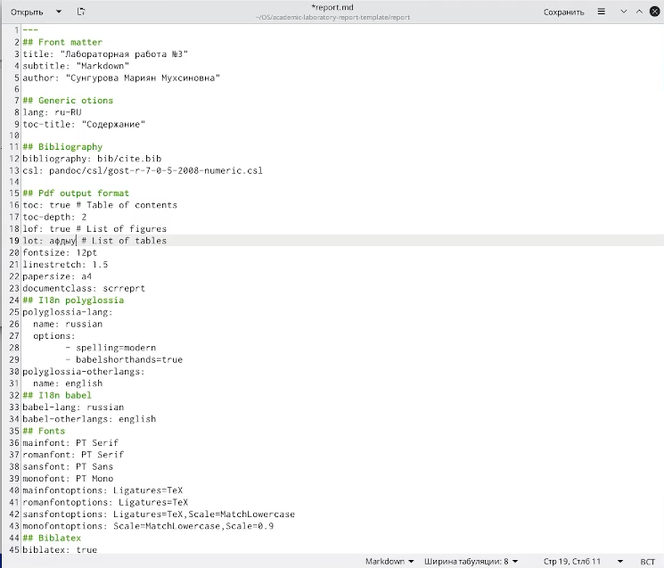
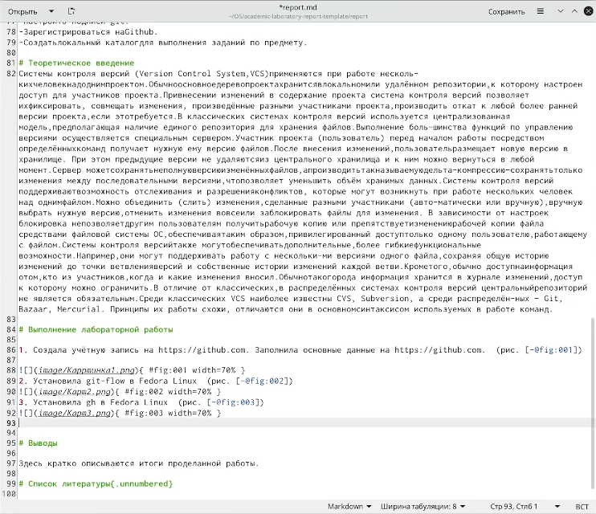
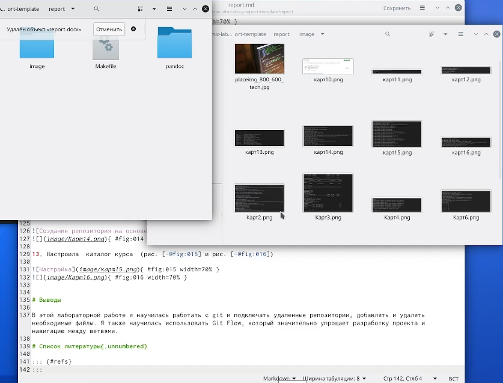
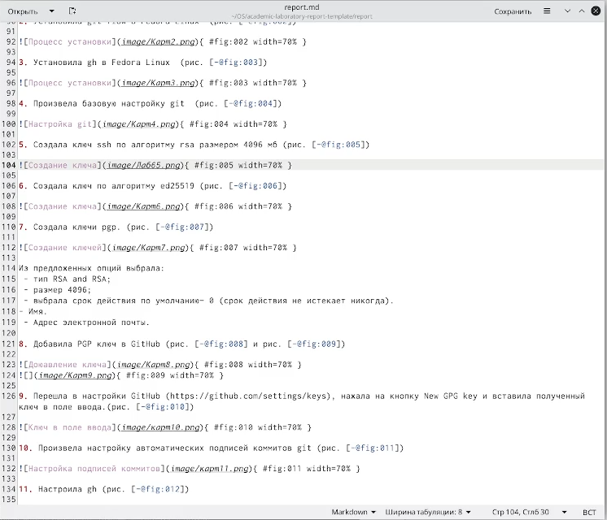
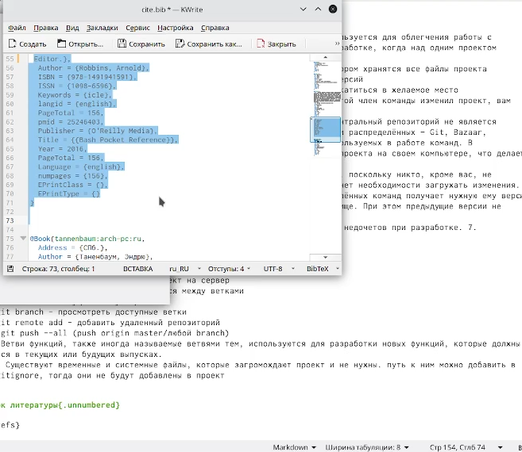

---
## Front matter
title: "Лабораторная работа №3"
subtitle: "Markdown"
author: "Сунгурова Мариян Мухсиновна"

## Generic otions
lang: ru-RU
toc-title: "Содержание"

## Bibliography
bibliography: bib/cite.bib
csl: pandoc/csl/gost-r-7-0-5-2008-numeric.csl

## Pdf output format
toc: true # Table of contents
toc-depth: 2
lof: true # List of figures
lot: false # List of tables
fontsize: 12pt
linestretch: 1.5
papersize: a4
documentclass: scrreprt
## I18n polyglossia
polyglossia-lang:
  name: russian
  options:
	- spelling=modern
	- babelshorthands=true
polyglossia-otherlangs:
  name: english
## I18n babel
babel-lang: russian
babel-otherlangs: english
## Fonts
mainfont: PT Serif
romanfont: PT Serif
sansfont: PT Sans
monofont: PT Mono
mainfontoptions: Ligatures=TeX
romanfontoptions: Ligatures=TeX
sansfontoptions: Ligatures=TeX,Scale=MatchLowercase
monofontoptions: Scale=MatchLowercase,Scale=0.9
## Biblatex
biblatex: true
biblio-style: "gost-numeric"
biblatexoptions:
  - parentracker=true
  - backend=biber
  - hyperref=auto
  - language=auto
  - autolang=other*
  - citestyle=gost-numeric
## Pandoc-crossref LaTeX customization
figureTitle: "Рис."
tableTitle: "Таблица"
listingTitle: "Листинг"
lofTitle: "Список иллюстраций"
lotTitle: "Список таблиц"
lolTitle: "Листинги"
## Misc options
indent: true
header-includes:
  - \usepackage{indentfirst}
  - \usepackage{float} # keep figures where there are in the text
  - \floatplacement{figure}{H} # keep figures where there are in the text
---

# Цель работы

Научиться оформлять отчёты с помощью легковесного языка разметки Markdown.

# Задание

- Сделайте отчёт по предыдущей лабораторной работе в формате Markdown.
- Вкачествеотчётапросьбапредоставитьотчётыв3форматах:pdf,docx иmd (вархиве,
поскольку он должен содержать скриншоты,Makefile ит.д.)

# Теоретическое введение
- Markdown (произносится маркда́ун) — облегчённый язык разметки, созданный с целью обозначения форматирования в простом тексте, с максимальным сохранением его читаемости человеком, и пригодный для машинного преобразования в языки для продвинутых публикаций (HTML, Rich Text и других). 
- Первоначально создан в 2004 году Джоном Грубером и Аароном Шварцем. Многие идеи языка были позаимствованы из существующих соглашений по разметке текста в электронных письмах. Реализации языка Markdown преобразуют текст в формате Markdown в валидный, правильно построенный XHTML и заменяют левые угловые скобки  [@gnu-doc:bash](«<») и амперсанды («&») на соответствующие коды сущностей. Первой реализацией Markdown стала написанная Грубером реализация на Perl, однако спустя некоторое время появилось множество реализаций от сторонних разработчиков (см. ниже). Реализация на Perl распространяется по лицензии типа BSD. Реализации Markdown на различных языках программирования включены (или доступны в качестве плагина) во многие системы управления содержимым. 

# Выполнение лабораторной работы

1. Приступила к редактированию файла report.md  (рис. [-@fig:001])

{ #fig:001 width=70% }

2. Теоретическое введение (рис. [-@fig:002])

{ #fig:002 width=70% }

3.  Создание ссылок на фото из папки images (рис. [-@fig:003])

{ #fig:003 width=70% }

4. Описала шаги, прикрепив фото  (рис. [-@fig:004])

{ #fig:004 width=70% }

5. Описала источники (рис. [-@fig:005])

{ #fig:005 width=70% }

# Выводы

В этой лабораторной работе я научилась оформлять отчеты при помощи легковесного языка разметки Markdown, работать с фото и bib файлами для источников.

    

# Список литературы{.unnumbered}

::: {#refs}
:::
