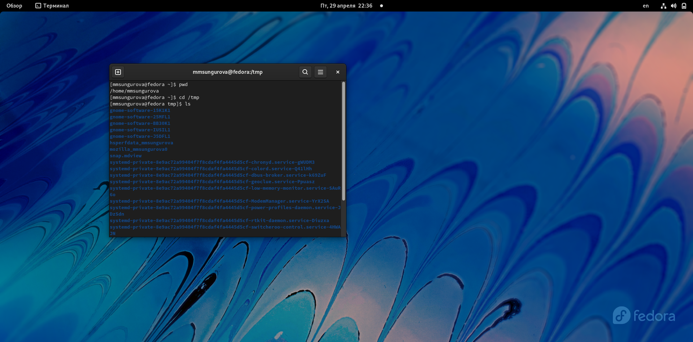
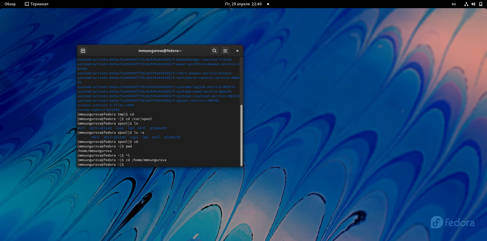
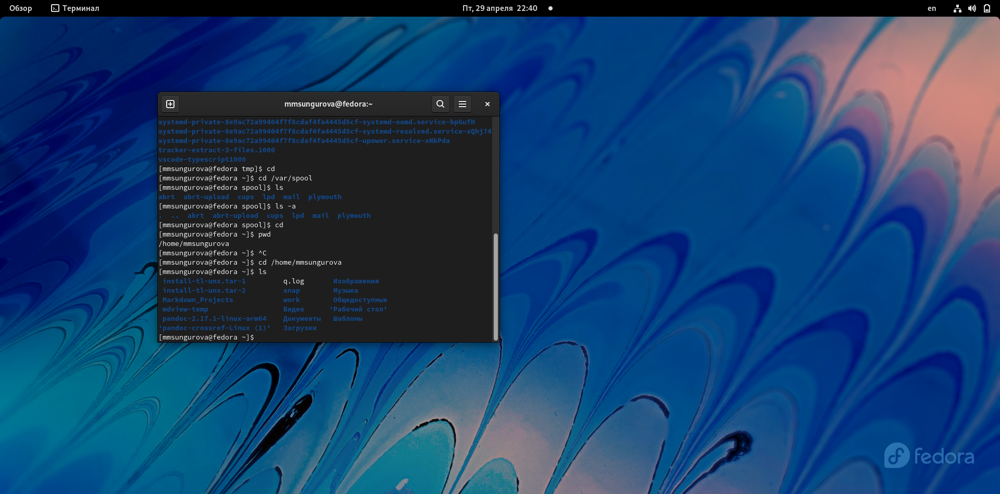
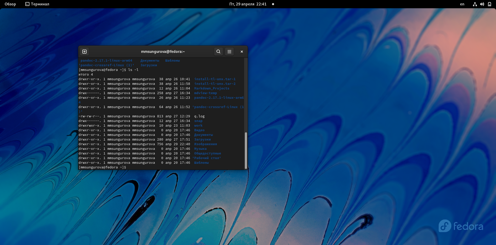
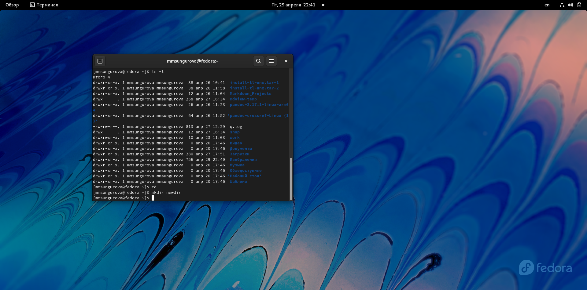
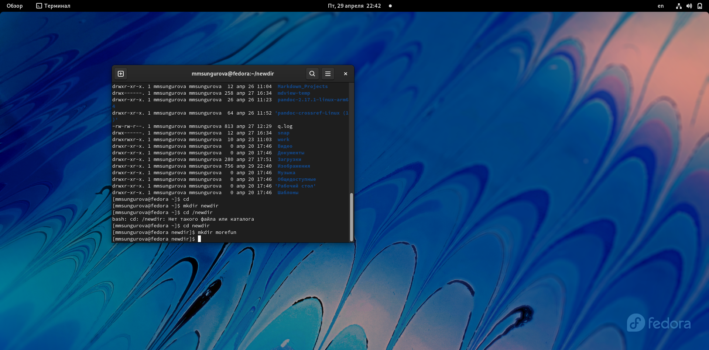
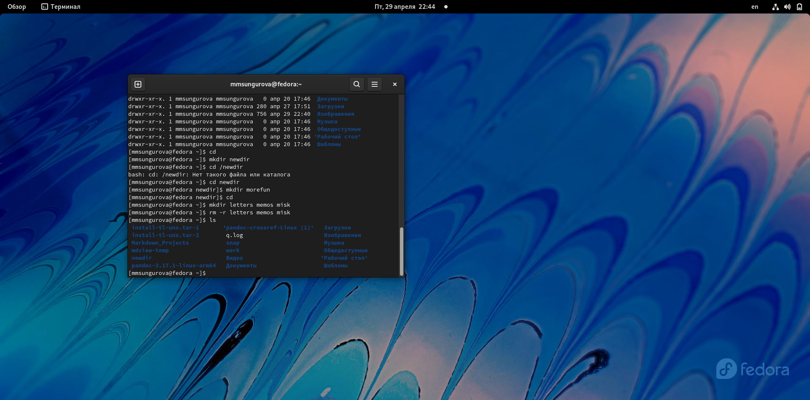
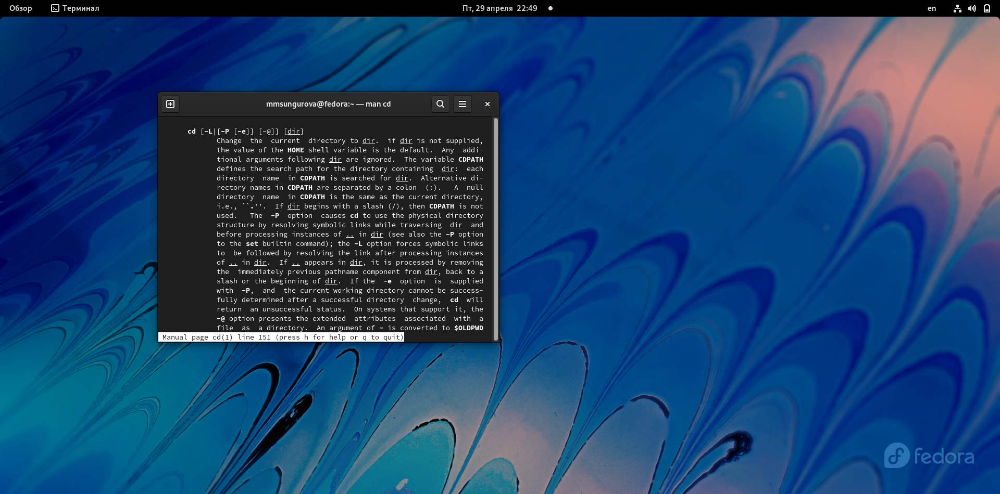
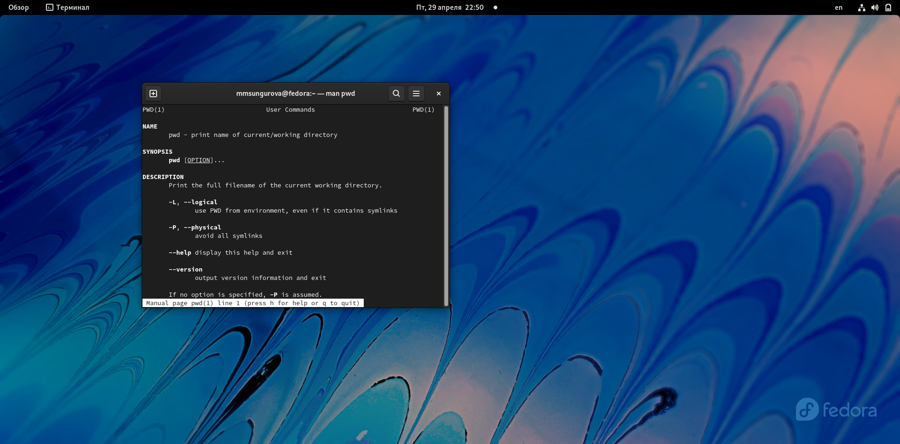
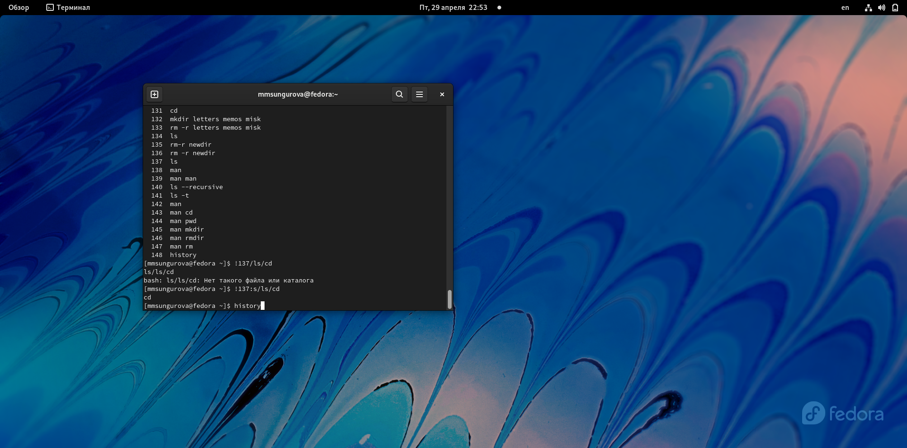

---
## Front matter
lang: ru-RU
title: Лабораторная работа №4
author: |
	Сунгурова Мариян Мухсиновна, НКНбд-01-21
	

## Formatting
toc: false
slide_level: 2
theme: metropolis
header-includes: 
 - \metroset{progressbar=frametitle,sectionpage=progressbar,numbering=fraction}
 - '\makeatletter'
 - '\beamer@ignorenonframefalse'
 - '\makeatother'
aspectratio: 43
section-titles: true
---

## Содержание
1. Цель работы
2. Процесс выполнения
3. Вывод
4. Источники

## Цель работы

Приобретение практических навыков взаимодействия пользователя с системой посредством командной строки

## Процесс выполнения

1. Определила полное имя домашнего каталога.Далее относительно этого ката-
лога будут выполняться последующие упражнения  (рис. [-@fig:001])

{ #fig:001 width=70% }

## Процесс выполнения

2. Перешла в каталог /tmp.  (рис. [-@fig:001])

## Процесс выполнения

3. Вывела на экран содержимое каталога /tmp.Для этого использовала команду ls
с различными опциями. (рис. [-@fig:001])

## Процесс выполнения

4. Определила,что в каталоге /var/spool нет подкаталога с именем cron  (рис. [-@fig:002])

{ #fig:002 width=70% }

## Процесс выполнения

5. Перешла в домашний каталог и вывела на экран его содержимое. (рис. [-@fig:003 , -@fig:004])

{ #fig:003 width=70% }

{ #fig:004 width=70% }

## Процесс выполнения

6.  В домашнем каталоге создала новый каталог с именем newdir (рис. [-@fig:005])

{ #fig:005 width=70% }

## Процесс выполнения

7.В каталоге ~/newdir создала новый каталог с именем morefun. (рис. [-@fig:006])

{ #fig:006 width=70% }

## Процесс выполнения
 
8. В домашнем каталоге создала одной командойтри новых каталога с именами
letters,memos,misk.Затем удалила эти каталоги одной командой (рис. [-@fig:007])

{ #fig:007 width=70% }

## Процесс выполнения

9. Удалила каталог ~/newdir/morefun из домашнего каталога.Проверила,был ли
каталог удалён(рис. [-@fig:007])

## Процесс выполнения

10. С помощью команды man определила, какую опцию команды ls нужно использо-
ватьдля просмотра содержимое нетолько указанного каталога,но и подкаталогов,
входящих в него. (рис. [-@fig:008])

{ #fig:008 width=70% }

## Процесс выполнения

11. С помощью команды man определила набор опций команды ls, позволяющий отсорти-
ровать по времени последнего изменения выводимый список содержимого каталога
с развёрнутым описанием файлов. (рис. [-@fig:010])

{ #fig:010 width=70% }

## Процесс выполнения

12. Использовала команду man для просмотра описания следующих команд: cd,pwd,mkdir,
rmdir,rm. (рис. [-@fig:011  , -@fig:012 , , -@fig:013 , -@fig:014 , -@fig:015 ])

{ #fig:011 width=70% }

{ #fig:012 width=70% }

{ #fig:013 width=70% }

{ #fig:014 width=70% }

{ #fig:015 width=70% }

## Процесс выполнения

13. Используя информацию,полученную при помощи команды history,выполнила мо-
дификацию и исполнение нескольких команд из буфера команд.
 (рис. [-@fig:016])

{ #fig:016 width=70% }

## Вывод
Результатом выполнения данной лабораторной работы стало приобретение практических 
навыков взаимодействия пользователя с системой посредством командной строки

## ИСточники

1. КулябовД. С. Введение в операционные системы –Лекция;

