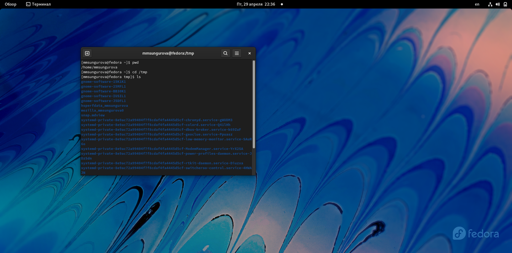
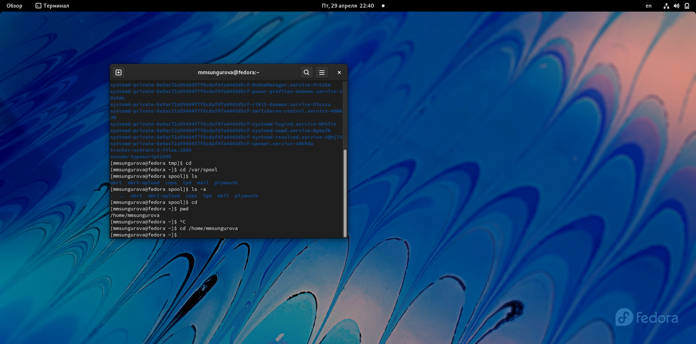
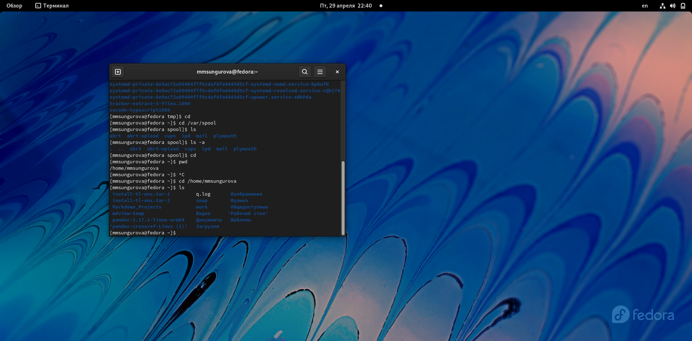
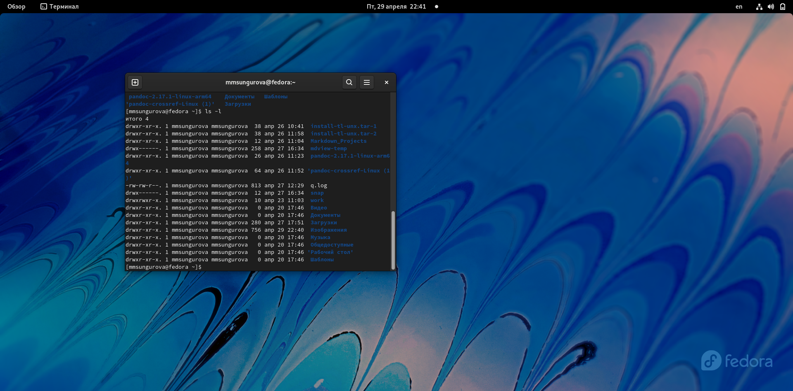
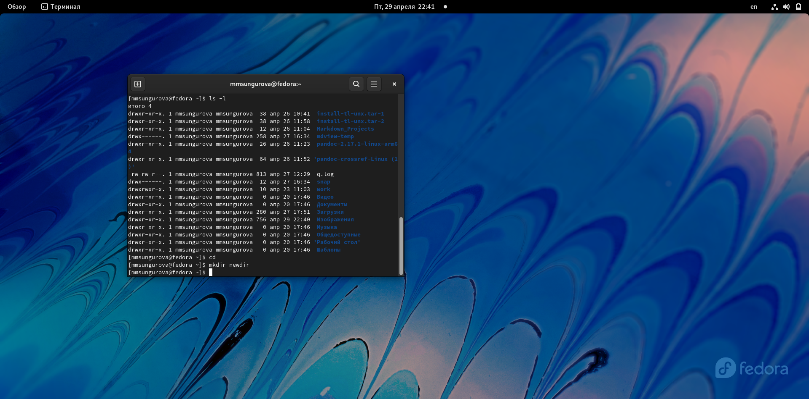
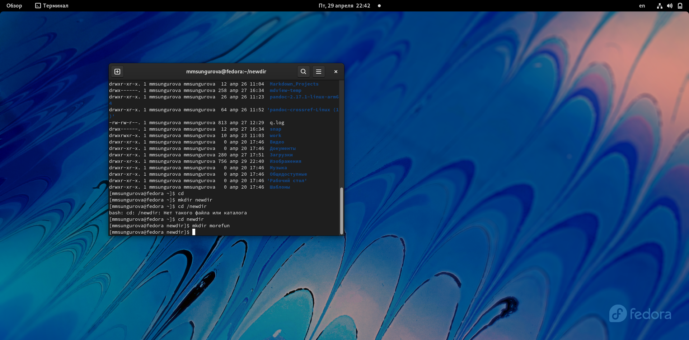
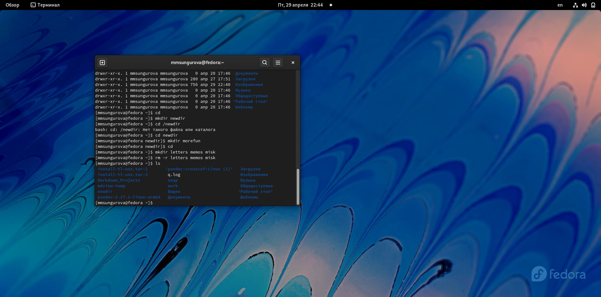
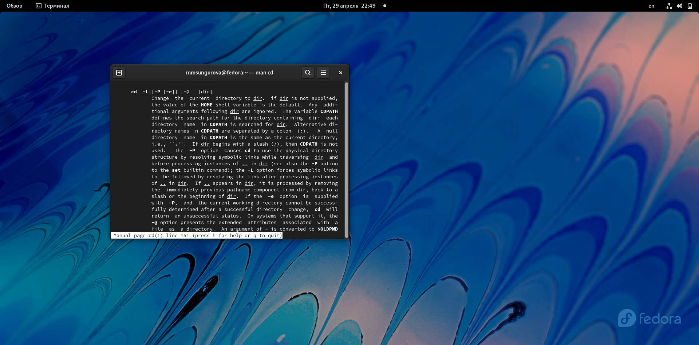
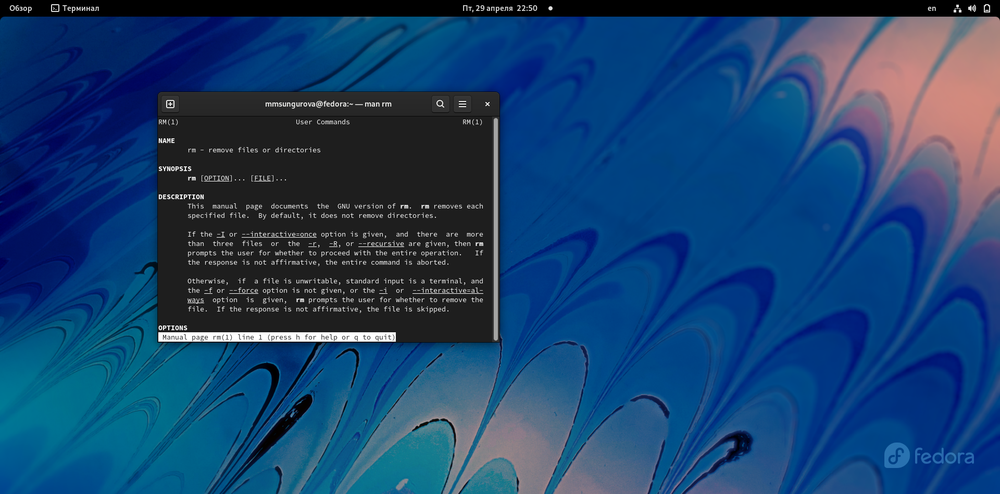
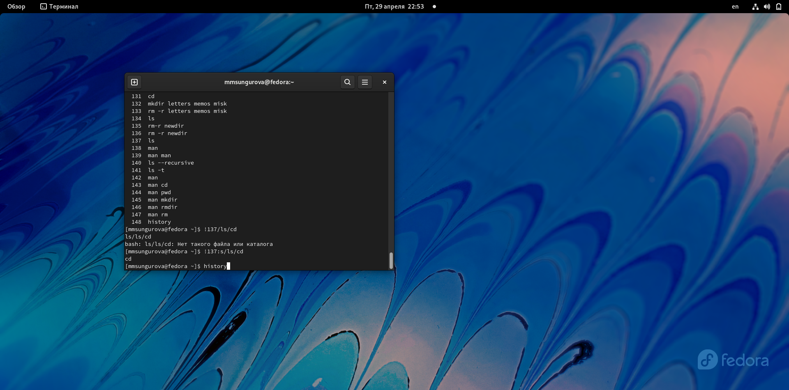

---
## Front matter
title: "Лабораторная работа №4"
subtitle: "Основы интерфейса взаимодействия пользователя с системой Unix на уровне командной строки"
author: "Сунгурова Мариян Мухсиновна"

## Generic otions
lang: ru-RU
toc-title: "Содержание"

## Bibliography
bibliography: bib/cite.bib
csl: pandoc/csl/gost-r-7-0-5-2008-numeric.csl

## Pdf output format
toc: true # Table of contents
toc-depth: 2
lof: true # List of figures
lot: false # List of tables
fontsize: 12pt
linestretch: 1.5
papersize: a4
documentclass: scrreprt
## I18n polyglossia
polyglossia-lang:
  name: russian
  options:
	- spelling=modern
	- babelshorthands=true
polyglossia-otherlangs:
  name: english
## I18n babel
babel-lang: russian
babel-otherlangs: english
## Fonts
mainfont: PT Serif
romanfont: PT Serif
sansfont: PT Sans
monofont: PT Mono
mainfontoptions: Ligatures=TeX
romanfontoptions: Ligatures=TeX
sansfontoptions: Ligatures=TeX,Scale=MatchLowercase
monofontoptions: Scale=MatchLowercase,Scale=0.9
## Biblatex
biblatex: true
biblio-style: "gost-numeric"
biblatexoptions:
  - parentracker=true
  - backend=biber
  - hyperref=auto
  - language=auto
  - autolang=other*
  - citestyle=gost-numeric
## Pandoc-crossref LaTeX customization
figureTitle: "Рис."
tableTitle: "Таблица"
listingTitle: "Листинг"
lofTitle: "Список иллюстраций"
lotTitle: "Список таблиц"
lolTitle: "Листинги"
## Misc options
indent: true
header-includes:
  - \usepackage{indentfirst}
  - \usepackage{float} # keep figures where there are in the text
  - \floatplacement{figure}{H} # keep figures where there are in the text
---

# Цель работы

Приобретение практических навыков взаимодействия пользователя с системой посредством командной строки

# Задание

В операционной системетипа Linux взаимодействие пользователя с системой обычно
осуществляется с помощью командной строки посредством построчного ввода команд.
При этом обычно используется командные интерпретаторы языка shell: /bin/sh;
/bin/csh; /bin/ksh.

# Теоретическое введение

Основная среда взаимодействия с UNIX — командная строка. Суть её в том, что каждая строка, передаваемая пользователем системе, — это команда, которую та должна выполнить.
Более подробно об Unix см. в [@gnu-doc:bash;@newham:2005:bash;@zarrelli:2017:bash;@robbins:2013:bash;@tannenbaum:arch-pc:ru;@tannenbaum:modern-os:ru].

# Выполнение лабораторной работы

1. Определила полное имя домашнего каталога.Далее относительно этого ката-
лога будут выполняться последующие упражнения  (рис. [-@fig:001])

{ #fig:001 width=70% }

2. Перешла в каталог /tmp.  (рис. [-@fig:001])

3. Вывела на экран содержимое каталога /tmp.Для этого использовала команду ls
с различными опциями. (рис. [-@fig:001])

4. Определила,что в каталоге /var/spool нет подкаталога с именем cron  (рис. [-@fig:002])

{ #fig:002 width=70% }

5. Перешла в домашний каталог и вывела на экран его содержимое. (рис. [-@fig:003 , -@fig:004])

{ #fig:003 width=70% }

{ #fig:004 width=70% }

6.  В домашнем каталоге создала новый каталог с именем newdir (рис. [-@fig:005])

{ #fig:005 width=70% }

7.В каталоге ~/newdir создала новый каталог с именем morefun. (рис. [-@fig:006])

{ #fig:006 width=70% }
 
8. В домашнем каталоге создала одной командойтри новых каталога с именами
letters,memos,misk.Затем удалила эти каталоги одной командой (рис. [-@fig:007])

{ #fig:007 width=70% }

9. Удалила каталог ~/newdir/morefun из домашнего каталога.Проверила,был ли
каталог удалён(рис. [-@fig:007])

10. С помощью команды man определила, какую опцию команды ls нужно использо-
ватьдля просмотра содержимое нетолько указанного каталога,но и подкаталогов,
входящих в него. (рис. [-@fig:008])

{ #fig:008 width=70% }

11. С помощью команды man определила набор опций команды ls, позволяющий отсорти-
ровать по времени последнего изменения выводимый список содержимого каталога
с развёрнутым описанием файлов. (рис. [-@fig:010])

{ #fig:010 width=70% }

12. Использовала команду man для просмотра описания следующих команд: cd,pwd,mkdir,
rmdir,rm. (рис. [-@fig:011  , -@fig:012 , , -@fig:013 , -@fig:014 , -@fig:015 ])

{ #fig:011 width=70% }

{ #fig:012 width=70% }

{ #fig:013 width=70% }

{ #fig:014 width=70% }

{ #fig:015 width=70% }

13. Используя информацию,полученную при помощи команды history,выполнила мо-
дификацию и исполнение нескольких команд из буфера команд.
 (рис. [-@fig:016])

{ #fig:016 width=70% }

# Выводы

Результатом выполнения данной лабораторной работы стало приобретение практических 
навыков взаимодействия пользователя с системой посредством командной строки

# Контрольные вопросы 
1. командная строка — это программа, которая эмулирует поле ввода в текстовом экране пользовательского интерфейса с помощью графического интерфейса пользователя.
2. pwd (аббревиатура от print working directory) возвращает полный путь текущего каталога командной оболочки, естественно, именно той командной оболочки, при помощи которой была выполнена команда pwd .
3. ls -l
4. при помощи команды ls -a
5. Удалить файл - rm; каталог - rmdir  или  rm -r
6. при помощи команды history 
7. Для вывода на экран списка ранее выполненных команд исполь-
зуется команда history.Можно модифицировать команду из выведенного на экран списка при помощи следу-
ющей конструкции: !<номер_команды>:s/<что_меняем>/<на_что_меняем>8. 
9. экранирование символов — замена в тексте управляющих символов на соответствующие текстовые подстановки.
10. Чтобы вывести на экран подробную информацию о файлах и каталогах,необходимо
использовать опцию l.При этом о каждом файле и каталоге будет выведена следующая
информация:
– тип файла,
– право доступа,
– число ссылок,
– владелец,
– размер,
– дата последней ревизии,
– имя файла или каталога.
11. Относительный путь к файлу от документа — это путь к файлу относительно текущего документа. Такой адрес зависит от расположения файла, в котором он записан.
12. при помощи команды man + интересующая вас команда
13. Ctrl+Y — вставить последний текст, добавленный в буфер обмена.
Shift+Insert — вставить текст из буфера обмена в строку терминала.

# Список литературы{.unnumbered}

::: {#refs}
:::
