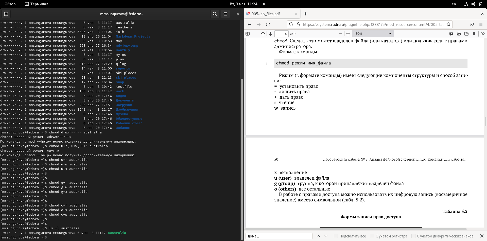

---
## Front matter
lang: ru-RU
title: Лабораторная работа №5
author: |
	Сунгурова Мариян Мухсиновна, НКНбд-01-21
	

## Formatting
toc: false
slide_level: 2
theme: metropolis
header-includes: 
 - \metroset{progressbar=frametitle,sectionpage=progressbar,numbering=fraction}
 - '\makeatletter'
 - '\beamer@ignorenonframefalse'
 - '\makeatother'
aspectratio: 43
section-titles: true
---

## Содержание
1. Цель работы
2. Процесс выполнения
3. Вывод
4. Источники

## Цель работы

Ознакомление с файловой системой Linux, её структурой, именами и содержанием
каталогов. Приобретение практических навыков по применению команд для работы
с файлами и каталогами, по управлению процессами (и работами), по проверке исполь-
зования диска и обслуживанию файловой системы.

## Процесс выполнения

1. Выполните все примеры, приведённые в первой части описания лабораторной работы.
-  1.1  Копировала файла в текущем каталоге. Скопировала файл ~/abc1 в файл april
и в файл may: (рис. [-@fig:001])
-  1.2 Копирование нескольких файлов в каталог. Скопировала файлы april и may в каталог
monthly: (рис. [-@fig:001])
-  1.3 Копирование файлов в произвольном каталоге. Скопировала файл monthly/may в файл
с именем june: (рис. [-@fig:001])

{ #fig:001 width=70% }

## Процесс выполнения

-  1.4 Копирование каталогов в текущем каталоге. Скопировала каталог monthly в каталог
monthly.00

-  1.5 Копирование каталогов в произвольном каталоге. Скопировала каталог monthly.00
в каталог /tmp
  

## Процесс выполнения

- 1.6 Переименовала файлы в текущем каталоге. Изменила название файла april на
july в домашнем каталоге
- 1.7 Перемещение файлов в другой каталог. Переместила файл july в каталог monthly.00

- 1.8 Переименование каталогов в текущем каталоге. Переименовала каталог monthly.00
в monthly.01 

## Процесс выполнения

- 1.9 Перемещение каталога в другой каталог. Переместила каталог monthly.01в каталог
reports

- 1.10 Переименование каталога, не являющегося текущим. Переименовала каталог
reports/monthly.01 в reports/monthly: 

## Процесс выполнения

- 1.11 Создала файл ~/may с правом выполнения для владельца

- 1.12 Лишила владельца файла ~/may права на выполнение

## Процесс выполнения

- 1.13 Создала каталог monthly с запретом на чтение для членов группы и всех
остальных пользователей

- 1.14 Создала файл ~/abc1 с правом записи для членов группы 

## Процесс выполнения

2. Выполните следующие действия, зафиксировав в отчёте по лабораторной работе
используемые при этом команды и результаты их выполнения

- 2.1 Скопировала файл /usr/include/sys/io.h в домашний каталог и назовала его
equipment. Если файла io.h нет, то использовала любой другой файл в каталоге
/usr/include/sys/ вместо него. 

## Процесс выполнения

- 2.2. В домашнем каталоге создала директорию ~/ski.plases. 

## Процесс выполнения

- 2.3. Переместила файл equipment в каталог ~/ski.plases.

## Процесс выполнения

- 2.4. Переименовала файл ~/ski.plases/equipment в ~/ski.plases/equiplist.

## Процесс выполнения

- 2.5. Создала в домашнем каталоге файл abc1 и скопировала его в каталог ~/ski.plases, назвала его equiplist2.

## Процесс выполнения

- 2.6. Создала каталог с именем equipment в каталоге ~/ski.plases.

## Процесс выполнения

- 2.7. Переместила файлы ~/ski.plases/equiplist и equiplist2 в каталог ~/ski.plases/equipment.

## Процесс выполнения

- 2.8. Создала и переместила каталог ~/newdir в каталог ~/ski.plases и назвала его plans.

## Процесс выполнения

3. Определила опции команды chmod, необходимые для того, чтобы присвоить перечис-
ленным ниже файлам выделенные права доступа, считая, что в начале таких прав нет:

## Процесс выполнения

- 3.1. drwxr--r-- ... australia 

- 3.2. drwx--x--x ... play

- 3.3. -r-xr--r-- ... my_os

- 3.4. -rw-rw-r-- ... feathers(

## Процесс выполнения

4. Проделала приведённые ниже упражнения, записывая в отчёт по лабораторной
работе используемые при этом команды:

- 4.1. Просмотрела содержимое файла /etc/password. 

- 4.2. Скопировала файл ~/feathers в файл ~/file.old. 

- 4.3. Переместила файл ~/file.old в каталог ~/play. 

- 4.4. Скопировала каталог ~/play в каталог ~/fun. 
 
- 4.5. Переместила каталог ~/fun в каталог ~/play и назовала его games.

- 4.6. Лишила владельца файла ~/feathers права на чтение.

- 4.7. Что произойдёт, если вы попытаетесь просмотреть файл ~/feathers командой cat?

- 4.8. Что произойдёт, если вы попытаетесь скопировать файл ~/feathers?

- 4.9. Дала владельцу файла ~/feathers право на чтение. 

## Процесс выполнения

- 4.10. Лишила владельца каталога ~/play права на выполнение. (рис. [-@fig:026])

{ #fig:026 width=70% }

## Процесс выполнения

- 4.11. Перешла в каталог ~/play. Что произошло? (рис. [-@fig:027])

{ #fig:027 width=70% }

## Процесс выполнения

- 4.12. Дала владельцу каталога ~/play право на выполнение. (рис. [-@fig:028])

{ #fig:028 width=70% }

## Процесс выполнения

5. Прочитайте man по командам mount, fsck, mkfs, kill и кратко их охарактеризуйте, приведя примеры. (рис. [-@fig:029 ; -@fig:030 ; -@fig:031])

## Процесс выполнения

{ #fig:029 width=70% }

## Процесс выполнения

{ #fig:030 width=70% }

## Процесс выполнения

{ #fig:031 width=70% }

## Процесс выполнения

{ #fig:032 width=70% }

## Процесс выполнения

2. Перешла в каталог /tmp.  (рис. [-@fig:001])

## Процесс выполнения

3. Вывела на экран содержимое каталога /tmp.Для этого использовала команду ls
с различными опциями. (рис. [-@fig:001])

## Процесс выполнения

4. Определила,что в каталоге /var/spool нет подкаталога с именем cron  (рис. [-@fig:002])

{ #fig:002 width=70% }

## Процесс выполнения

5. Перешла в домашний каталог и вывела на экран его содержимое. (рис. [-@fig:003 , -@fig:004])

{ #fig:003 width=70% }

{ #fig:004 width=70% }

## Процесс выполнения

6.  В домашнем каталоге создала новый каталог с именем newdir (рис. [-@fig:005])

{ #fig:005 width=70% }

## Процесс выполнения

7.В каталоге ~/newdir создала новый каталог с именем morefun. (рис. [-@fig:006])

{ #fig:006 width=70% }

## Процесс выполнения
 
8. В домашнем каталоге создала одной командойтри новых каталога с именами
letters,memos,misk.Затем удалила эти каталоги одной командой (рис. [-@fig:007])

{ #fig:007 width=70% }

## Процесс выполнения

9. Удалила каталог ~/newdir/morefun из домашнего каталога.Проверила,был ли
каталог удалён(рис. [-@fig:007])

## Процесс выполнения

10. С помощью команды man определила, какую опцию команды ls нужно использо-
ватьдля просмотра содержимое нетолько указанного каталога,но и подкаталогов,
входящих в него. (рис. [-@fig:008])

{ #fig:008 width=70% }

## Процесс выполнения

11. С помощью команды man определила набор опций команды ls, позволяющий отсорти-
ровать по времени последнего изменения выводимый список содержимого каталога
с развёрнутым описанием файлов. (рис. [-@fig:010])

{ #fig:010 width=70% }

## Процесс выполнения

12. Использовала команду man для просмотра описания следующих команд: cd,pwd,mkdir,
rmdir,rm. (рис. [-@fig:011  , -@fig:012 , , -@fig:013 , -@fig:014 , -@fig:015 ])

## Процесс выполнения

{ #fig:011 width=70% }

## Процесс выполнения

{ #fig:012 width=70% }

## Процесс выполнения

{ #fig:013 width=70% }

## Процесс выполнения

{ #fig:014 width=70% }

## Процесс выполнения

{ #fig:015 width=70% }

## Процесс выполнения

13. Используя информацию,полученную при помощи команды history,выполнила мо-
дификацию и исполнение нескольких команд из буфера команд.
 (рис. [-@fig:016])

{ #fig:016 width=70% }

## Вывод
Результатом выполнения данной лабораторной работы стало ознакомление с файловой системой Linux, её структурой, именами и содержанием каталогов; приобретение практических навыков по применению команд для работы
с файлами и каталогами, по управлению процессами (и работами), по проверке исполь-
зования диска и обслуживанию файловой системы.

