---
## Front matter
title: "Лабораторная работа №5"
subtitle: "Анализ файловой системы Linux.
           Команды для работы с файлами и каталогами"
author: "Сунгурова Мариян Мухсиновна"

## Generic otions
lang: ru-RU
toc-title: "Содержание"

## Bibliography
bibliography: bib/cite.bib
csl: pandoc/csl/gost-r-7-0-5-2008-numeric.csl

## Pdf output format
toc: true # Table of contents
toc-depth: 2
lof: true # List of figures
lot: false # List of tables
fontsize: 12pt
linestretch: 1.5
papersize: a4
documentclass: scrreprt
## I18n polyglossia
polyglossia-lang:
  name: russian
  options:
	- spelling=modern
	- babelshorthands=true
polyglossia-otherlangs:
  name: english
## I18n babel
babel-lang: russian
babel-otherlangs: english
## Fonts
mainfont: PT Serif
romanfont: PT Serif
sansfont: PT Sans
monofont: PT Mono
mainfontoptions: Ligatures=TeX
romanfontoptions: Ligatures=TeX
sansfontoptions: Ligatures=TeX,Scale=MatchLowercase
monofontoptions: Scale=MatchLowercase,Scale=0.9
## Biblatex
biblatex: true
biblio-style: "gost-numeric"
biblatexoptions:
  - parentracker=true
  - backend=biber
  - hyperref=auto
  - language=auto
  - autolang=other*
  - citestyle=gost-numeric
## Pandoc-crossref LaTeX customization
figureTitle: "Рис."
tableTitle: "Таблица"
listingTitle: "Листинг"
lofTitle: "Список иллюстраций"
lotTitle: "Список таблиц"
lolTitle: "Листинги"
## Misc options
indent: true
header-includes:
  - \usepackage{indentfirst}
  - \usepackage{float} # keep figures where there are in the text
  - \floatplacement{figure}{H} # keep figures where there are in the text
---

# Цель работы

Ознакомление с файловой системой Linux, её структурой, именами и содержанием
каталогов. Приобретение практических навыков по применению команд для работы
с файлами и каталогами, по управлению процессами (и работами), по проверке исполь-
зования диска и обслуживанию файловой системы.

# Задание

1. Выполните все примеры, приведённые в первой части описания лабораторной работы.
2. Выполните следующие действия, зафиксировав в отчёте по лабораторной работе
используемые при этом команды и результаты их выполнения:
2.1. Скопируйте файл /usr/include/sys/io.h в домашний каталог и назовите его
equipment. Если файла io.h нет, то используйте любой другой файл в каталоге
/usr/include/sys/ вместо него.
2.2. В домашнем каталоге создайте директорию ~/ski.plases.
2.3. Переместите файл equipment в каталог ~/ski.plases.
2.4. Переименуйте файл ~/ski.plases/equipment в ~/ski.plases/equiplist.
2.5. Создайте в домашнем каталоге файл abc1 и скопируйте его в каталог
~/ski.plases, назовите его equiplist2.
2.6. Создайте каталог с именем equipment в каталоге ~/ski.plases.
2.7. Переместите файлы ~/ski.plases/equiplist и equiplist2 в каталог
~/ski.plases/equipment.
2.8. Создайте и переместите каталог ~/newdir в каталог ~/ski.plases и назовите
его plans.
3. Определите опции команды chmod, необходимые для того, чтобы присвоить перечис-
ленным ниже файлам выделенные права доступа, считая, что в начале таких прав
нет:
3.1. drwxr--r-- ... australia
3.2. drwx--x--x ... play
3.3. -r-xr--r-- ... my_os
3.4. -rw-rw-r-- ... feathers
При необходимости создайте нужные файлы.
4. Проделайте приведённые ниже упражнения, записывая в отчёт по лабораторной
работе используемые при этом команды:
4.1. Просмотрите содержимое файла /etc/password.
4.2. Скопируйте файл ~/feathers в файл ~/file.old.
4.3. Переместите файл ~/file.old в каталог ~/play.
4.4. Скопируйте каталог ~/play в каталог ~/fun.
4.5. Переместите каталог ~/fun в каталог ~/play и назовите его games.
4.6. Лишите владельца файла ~/feathers права на чтение.
4.7. Что произойдёт, если вы попытаетесь просмотреть файл ~/feathers командой
cat?
4.8. Что произойдёт, если вы попытаетесь скопировать файл ~/feathers?
4.9. Дайте владельцу файла ~/feathers право на чтение.
4.10. Лишите владельца каталога ~/play права на выполнение.
4.11. Перейдите в каталог ~/play. Что произошло?
4.12. Дайте владельцу каталога ~/play право на выполнение.
5. Прочитайте man по командам mount, fsck, mkfs, kill и кратко их охарактеризуйте,
приведя примеры.

# Теоретическое введение

Во всех операционных системах, в том числе и в Linux, термин 'команда' означает либо утилиту командной строки, либо определённую возможность, встроенную в командную оболочку системы. Тем не менее, для самих пользователей это различие не имеет особого значения. В конце концов, и те и другие команды терминала Linux вызываются одинаково. Вы вводите слово в вашем эмуляторе терминала и получаете результат выполнения команды.

Более подробно об Unix см. в [@gnu-doc:bash;@newham:2005:bash;@zarrelli:2017:bash;@robbins:2013:bash;@tannenbaum:arch-pc:ru;@tannenbaum:modern-os:ru].

# Выполнение лабораторной работы

1. Выполните все примеры, приведённые в первой части описания лабораторной работы.
-  1.1  Копировала файла в текущем каталоге. Скопировала файл ~/abc1 в файл april
и в файл may: (рис. [-@fig:001])
-  1.2 Копирование нескольких файлов в каталог. Скопировала файлы april и may в каталог
monthly: (рис. [-@fig:001])
-  1.3 Копирование файлов в произвольном каталоге. Скопировала файл monthly/may в файл
с именем june: (рис. [-@fig:001])

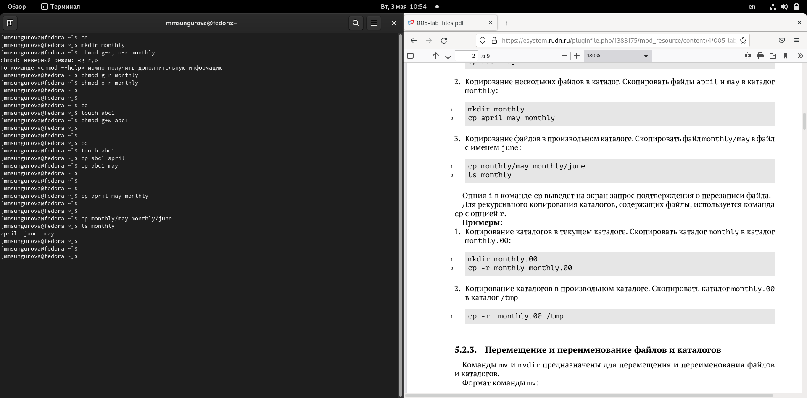{ #fig:001 width=70% }

-  1.4 Копирование каталогов в текущем каталоге. Скопировала каталог monthly в каталог
monthly.00:(рис. [-@fig:002])

-  1.5 Копирование каталогов в произвольном каталоге. Скопировала каталог monthly.00
в каталог /tmp: (рис. [-@fig:002])
  

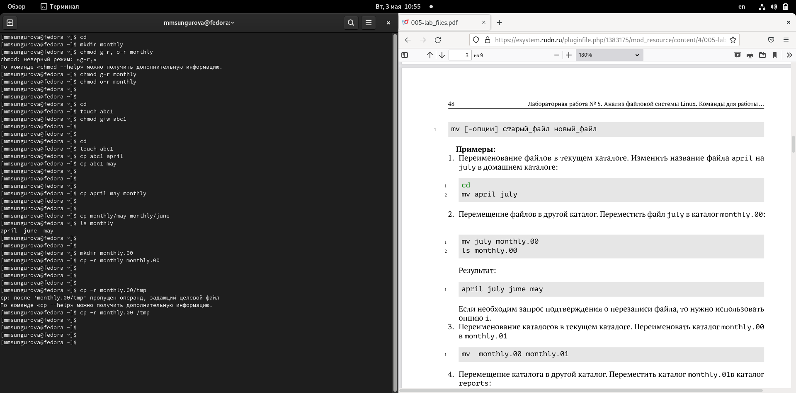{ #fig:002 width=70% }

- 1.6 Переименовала файлы в текущем каталоге. Изменила название файла april на
july в домашнем каталоге:(рис. [-@fig:003])

- 1.7 Перемещение файлов в другой каталог. Переместила файл july в каталог monthly.00:(рис. [-@fig:003])

- 1.8 Переименование каталогов в текущем каталоге. Переименовала каталог monthly.00
в monthly.01 (рис. [-@fig:003])

- 1.9 Перемещение каталога в другой каталог. Переместила каталог monthly.01в каталог
reports: (рис. [-@fig:003])

- 1.10 Переименование каталога, не являющегося текущим. Переименовала каталог
reports/monthly.01 в reports/monthly: (рис. [-@fig:003])

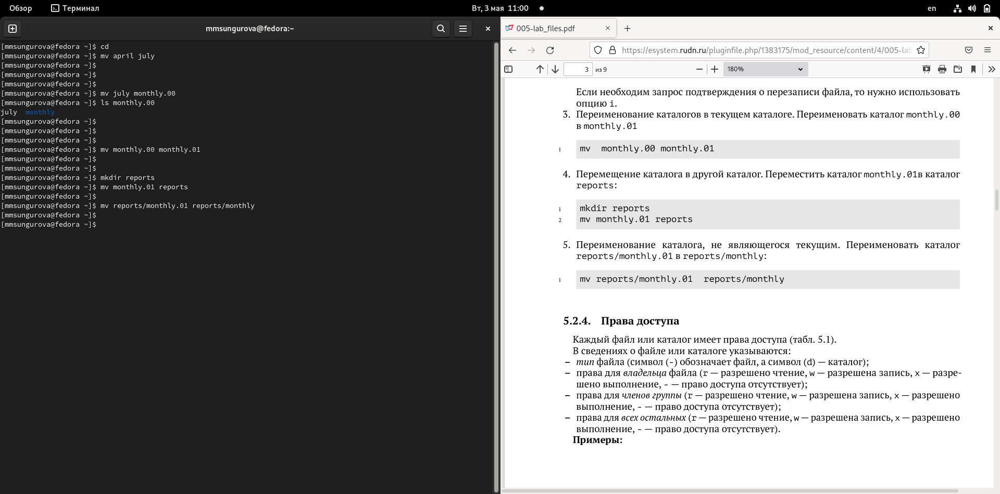{ #fig:003 width=70% }

- 1.11 Создала файл ~/may с правом выполнения для владельца:(рис. [-@fig:004])

- 1.12 Лишила владельца файла ~/may права на выполнение:(рис. [-@fig:004])

- 1.13 Создала каталог monthly с запретом на чтение для членов группы и всех
остальных пользователей:(рис. [-@fig:004])

- 1.14 Создала файл ~/abc1 с правом записи для членов группы (рис. [-@fig:004])

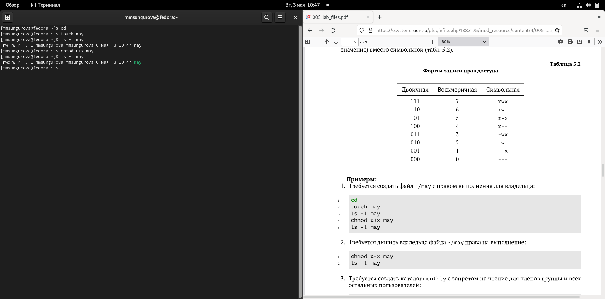{ #fig:004 width=70% }

2. Выполните следующие действия, зафиксировав в отчёте по лабораторной работе
используемые при этом команды и результаты их выполнения

- 2.1 Скопировала файл /usr/include/sys/io.h в домашний каталог и назовала его
equipment. Если файла io.h нет, то использовала любой другой файл в каталоге
/usr/include/sys/ вместо него. (рис. [-@fig:005])

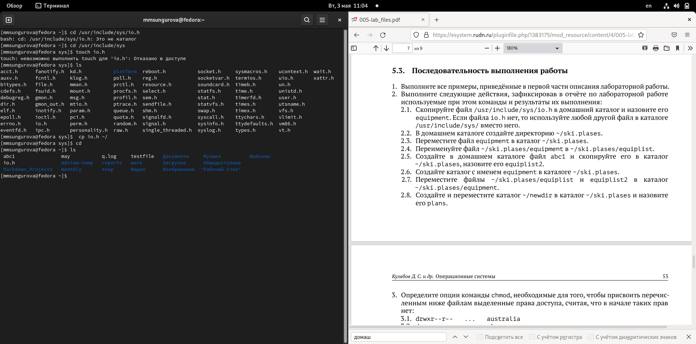{ #fig:005 width=70% }

- 2.2. В домашнем каталоге создала директорию ~/ski.plases. (рис. [-@fig:006])

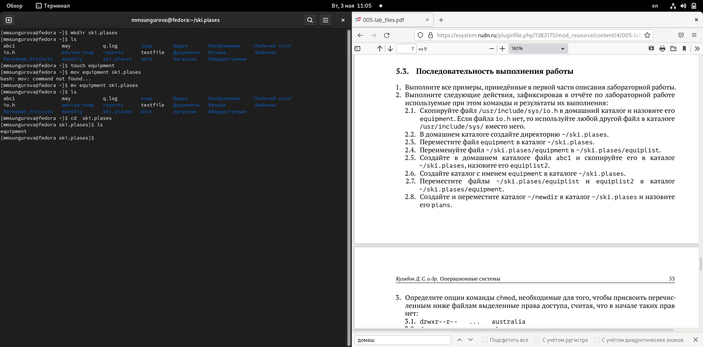{ #fig:006 width=70% }

- 2.3. Переместила файл equipment в каталог ~/ski.plases.(рис. [-@fig:007])

{ #fig:007 width=70% }

- 2.4. Переименовала файл ~/ski.plases/equipment в ~/ski.plases/equiplist.(рис. [-@fig:008])

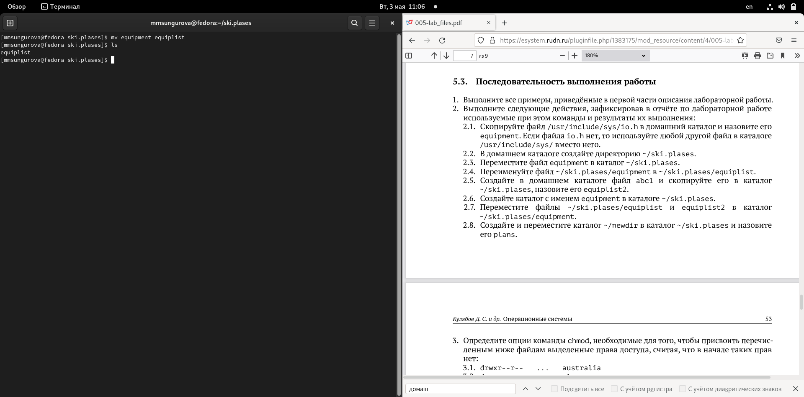{ #fig:008 width=70% }

- 2.5. Создала в домашнем каталоге файл abc1 и скопировала его в каталог ~/ski.plases, назвала его equiplist2.(рис. [-@fig:009])

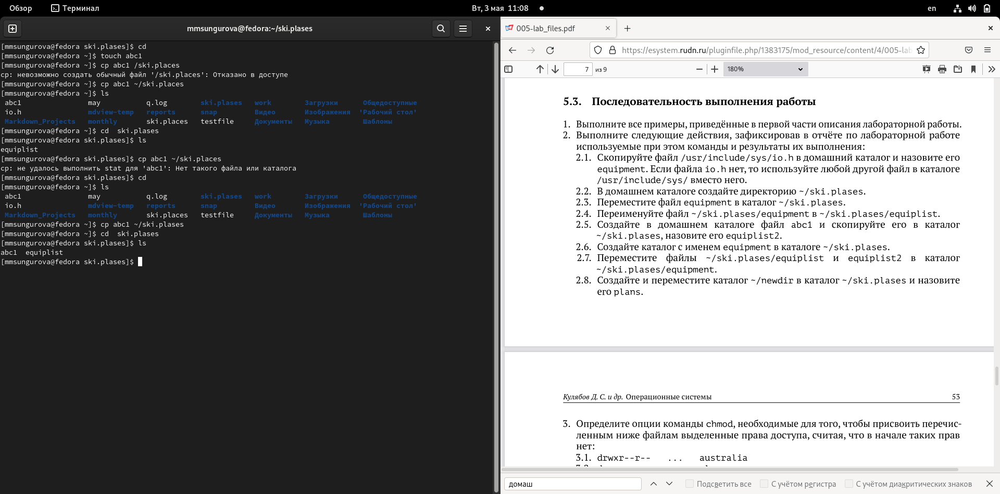{ #fig:009 width=70% }

- 2.6. Создала каталог с именем equipment в каталоге ~/ski.plases.(рис. [-@fig:010])

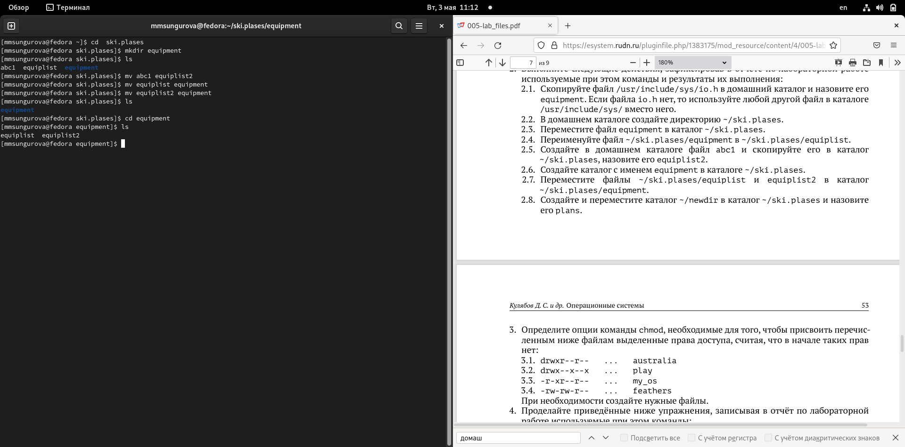{ #fig:010 width=70% }

- 2.7. Переместила файлы ~/ski.plases/equiplist и equiplist2 в каталог ~/ski.plases/equipment.(рис. [-@fig:011])

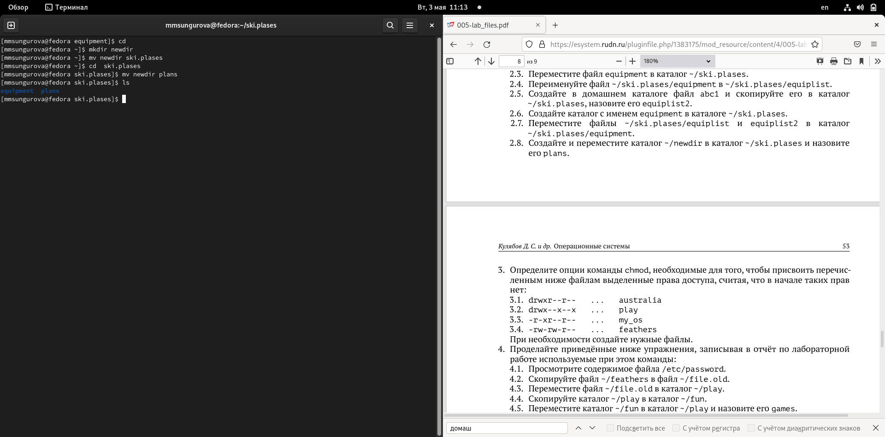{ #fig:011 width=70% }

- 2.8. Создала и переместила каталог ~/newdir в каталог ~/ski.plases и назвала его plans.(рис. [-@fig:012])

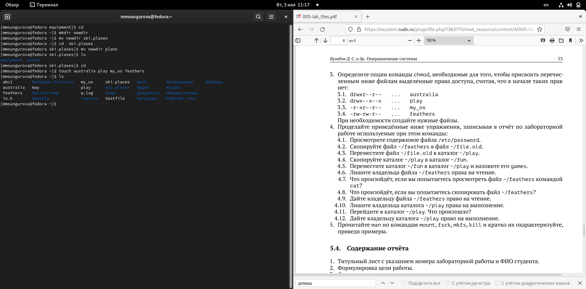{ #fig:012 width=70% }

3. Определила опции команды chmod, необходимые для того, чтобы присвоить перечис-
ленным ниже файлам выделенные права доступа, считая, что в начале таких прав
нет:
- 3.1. drwxr--r-- ... australia (рис. [-@fig:013])

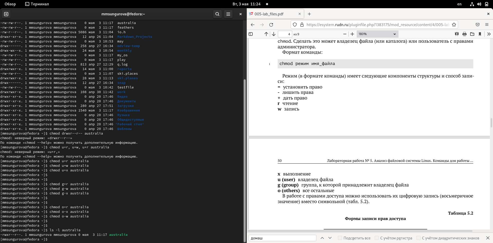{ #fig:013 width=70% }

- 3.2. drwx--x--x ... play(рис. [-@fig:014])

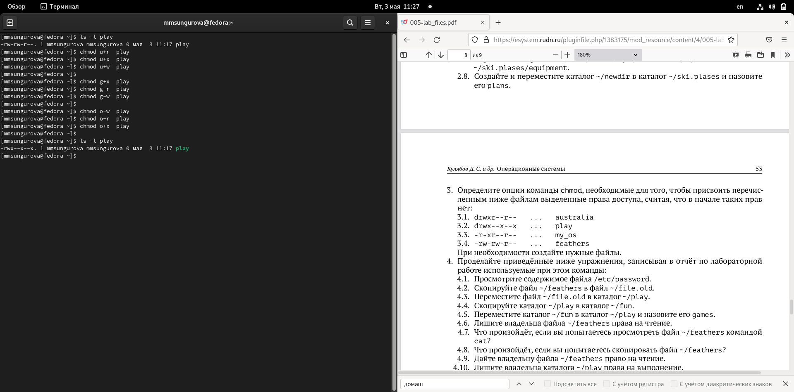{ #fig:014 width=70% }

- 3.3. -r-xr--r-- ... my_os(рис. [-@fig:015])

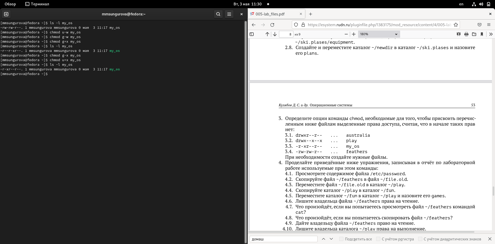{ #fig:015 width=70% }

- 3.4. -rw-rw-r-- ... feathers(рис. [-@fig:016])

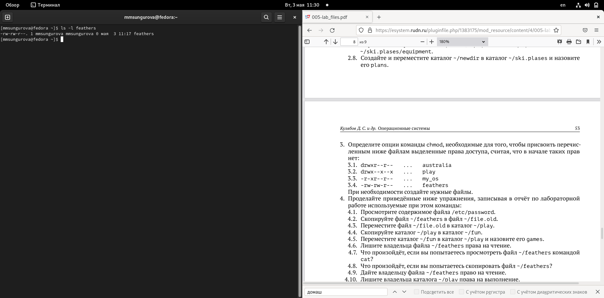{ #fig:016 width=70% }

4. Проделала приведённые ниже упражнения, записывая в отчёт по лабораторной
работе используемые при этом команды:

- 4.1. Просмотрела содержимое файла /etc/password. (рис. [-@fig:017])

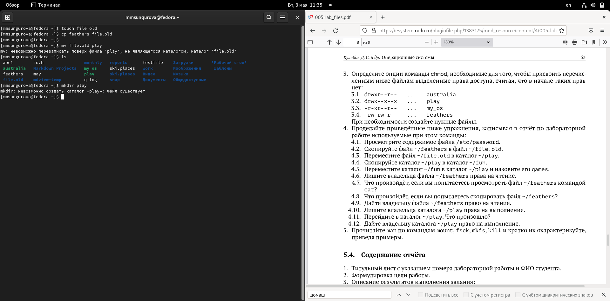{ #fig:017 width=70% }

- 4.2. Скопировала файл ~/feathers в файл ~/file.old. (рис. [-@fig:018])

{ #fig:018 width=70% }

- 4.3. Переместила файл ~/file.old в каталог ~/play. (рис. [-@fig:019])

{ #fig:019 width=70% }

- 4.4. Скопировала каталог ~/play в каталог ~/fun. (рис. [-@fig:020])

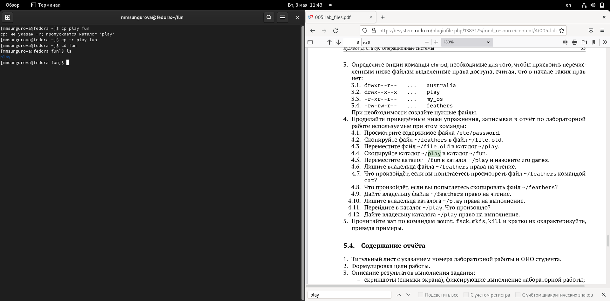{ #fig:020 width=70% }
 
- 4.5. Переместила каталог ~/fun в каталог ~/play и назовала его games.(рис. [-@fig:021]) 

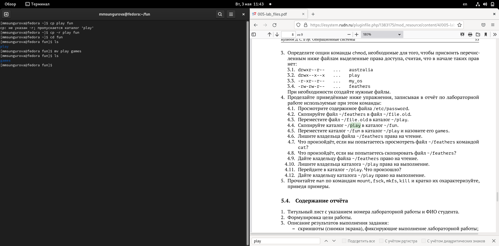{ #fig:021 width=70% }

- 4.6. Лишила владельца файла ~/feathers права на чтение.(рис. [-@fig:022]) 

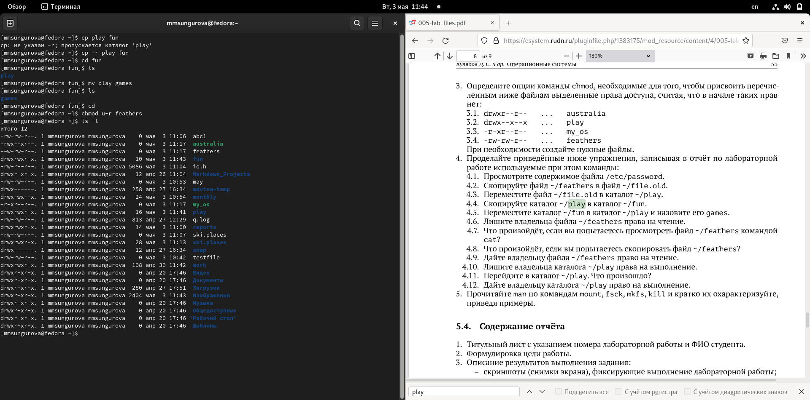{ #fig:022 width=70% }

- 4.7. Что произойдёт, если вы попытаетесь просмотреть файл ~/feathers командой cat?(рис. [-@fig:023])

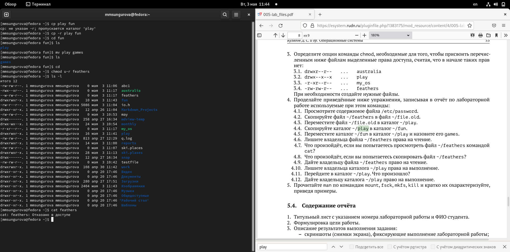{ #fig:023 width=70% }

- 4.8. Что произойдёт, если вы попытаетесь скопировать файл ~/feathers?(рис. [-@fig:024])

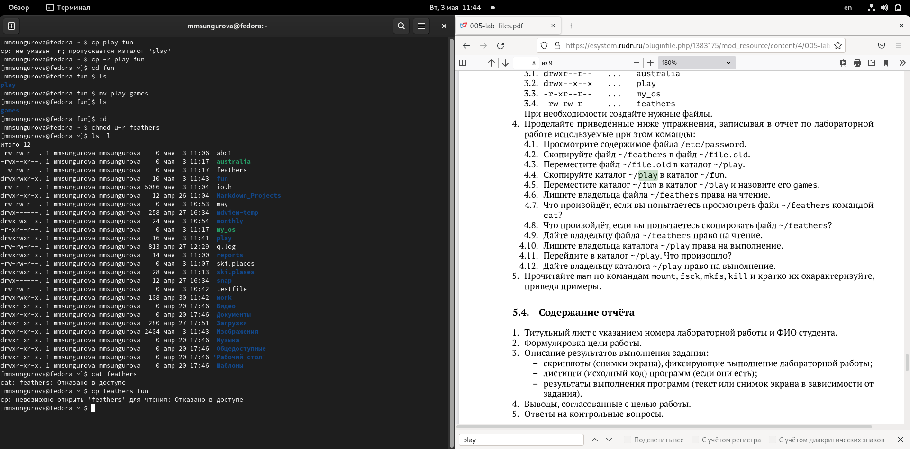{ #fig:024 width=70% }

- 4.9. Дала владельцу файла ~/feathers право на чтение. (рис. [-@fig:025])

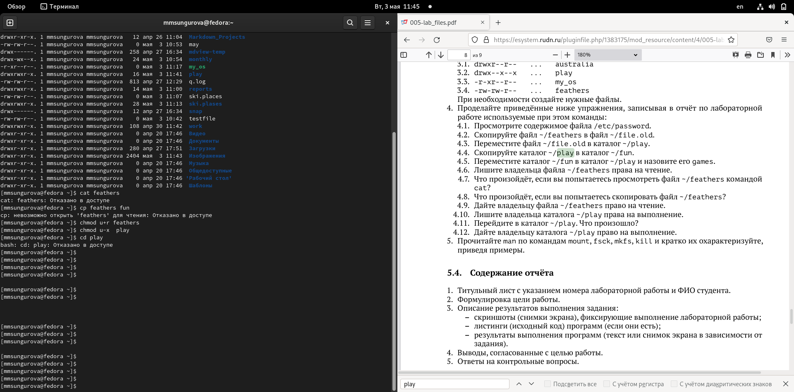{ #fig:025 width=70% }

- 4.10. Лишила владельца каталога ~/play права на выполнение. (рис. [-@fig:026])

{ #fig:026 width=70% }

- 4.11. Перешла в каталог ~/play. Что произошло? (рис. [-@fig:027])

{ #fig:027 width=70% }

- 4.12. Дала владельцу каталога ~/play право на выполнение. (рис. [-@fig:028])

{ #fig:028 width=70% }

5. Прочитайте man по командам mount, fsck, mkfs, kill и кратко их охарактеризуйте, приведя примеры. (рис. [-@fig:029 ; -@fig:030 ; -@fig:031])

{ #fig:029 width=70% }

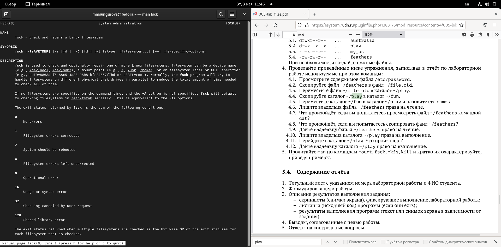{ #fig:030 width=70% }

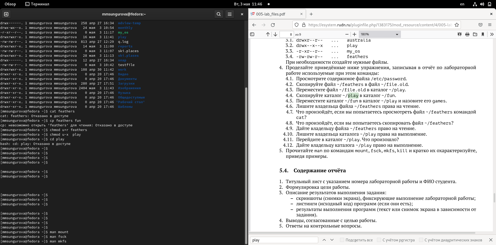{ #fig:031 width=70% }

{ #fig:032 width=70% }

# Выводы

Результатом выполнения данной лабораторной работы стало ознакомление с файловой системой Linux, её структурой, именами и содержанием каталогов; приобретение практических навыков по применению команд для работы
с файлами и каталогами, по управлению процессами (и работами), по проверке исполь-
зования диска и обслуживанию файловой системы.

# Контрольные вопросы 
1. Ext2, Ext3, Ext4 или Extended Filesystem - это стандартная файловая система для Linux. Она была разработана еще для Minix. Она самая стабильная из всех существующих, кодовая база изменяется очень редко и эта файловая система содержит больше всего функций. Версия ext2 была разработана уже именно для Linux и получила много улучшений. В 2001 году вышла ext3, которая добавила еще больше стабильности благодаря использованию журналирования. В 2006 была выпущена версия ext4, которая используется во всех дистрибутивах Linux до сегодняшнего дня. В ней было внесено много улучшений, в том числе увеличен максимальный размер раздела до одного экзабайта.

2. / — root каталог. Содержит в себе всю иерархию системы;

/bin — здесь находятся двоичные исполняемые файлы. Основные общие команды, хранящиеся отдельно от других программ в системе (прим.: pwd, ls, cat, ps);

/boot — тут расположены файлы, используемые для загрузки системы (образ initrd, ядро vmlinuz);

/dev — в данной директории располагаются файлы устройств (драйверов). С помощью этих файлов можно взаимодействовать с устройствами. К примеру, если это жесткий диск, можно подключить его к файловой системе. В файл принтера же можно написать напрямую и отправить задание на печать;

/etc — в этой директории находятся файлы конфигураций программ. Эти файлы позволяют настраивать системы, сервисы, скрипты системных демонов;

/home — каталог, аналогичный каталогу Users в Windows. Содержит домашние каталоги учетных записей пользователей (кроме root). При создании нового пользователя здесь создается одноименный каталог с аналогичным именем и хранит личные файлы этого пользователя;

/lib — содержит системные библиотеки, с которыми работают программы и модули ядра;

/lost+found — содержит файлы, восстановленные после сбоя работы системы. Система проведет проверку после сбоя и найденные файлы можно будет посмотреть в данном каталоге;

/media — точка монтирования внешних носителей. Например, когда вы вставляете диск в дисковод, он будет автоматически смонтирован в директорию /media/cdrom;

/mnt — точка временного монтирования. Файловые системы подключаемых устройств обычно монтируются в этот каталог для временного использования;

/opt — тут расположены дополнительные (необязательные) приложения. Такие программы обычно не подчиняются принятой иерархии и хранят свои файлы в одном подкаталоге (бинарные, библиотеки, конфигурации);

/proc — содержит файлы, хранящие информацию о запущенных процессах и о состоянии ядра ОС;

/root — директория, которая содержит файлы и личные настройки суперпользователя;

/run — содержит файлы состояния приложений. Например, PID-файлы или UNIX-сокеты;

/sbin — аналогично /bin содержит бинарные файлы. Утилиты нужны для настройки и администрирования системы суперпользователем;

/srv — содержит файлы сервисов, предоставляемых сервером (прим. FTP или Apache HTTP);

/sys — содержит данные непосредственно о системе. Тут можно узнать информацию о ядре, драйверах и устройствах;

/tmp — содержит временные файлы. Данные файлы доступны всем пользователям на чтение и запись. Стоит отметить, что данный каталог очищается при перезагрузке;

/usr — содержит пользовательские приложения и утилиты второго уровня, используемые пользователями, а не системой. Содержимое доступно только для чтения (кроме root). Каталог имеет вторичную иерархию и похож на корневой;

3. Монтирование тома.
4. Отсутствие синхронизации между образом файловой системы в памяти и ее данными на диске в случае аварийного останова может привести к появлению следующих ошибок:

		1. Один блок адресуется несколькими mode (принадлежит нескольким файлам).

		2. Блок помечен как свободный, но в то же время занят (на него ссылается onode).
	
		3. Блок помечен как занятый, но в то же время свободен (ни один inode на него не ссылается).

		4. Неправильное число ссылок в inode (недостаток или избыток ссылающихся записей в каталогах).

		5. Несовпадение между размером файла и суммарным размером адресуемых inode блоков.

		6. Недопустимые адресуемые блоки (например, расположенные за пределами файловой системы).

		7. "Потерянные" файлы (правильные inode, на которые не ссылаются записи каталогов).

5. mkfs - позволяет создать файловую систему Linux.
6. Cat - выводит содержимое файла на стандартное устройство вывода
7. Cp – копирует или перемещает директорию, файлы.
8. Mv - переименовать или переместить файл или директорию
9. Права доступа к файлу или каталогу можно изменить, воспользовавшись командой chmod. Сделать это может владелец файла (или каталога) или пользователь с правами администратора.

# Список литературы{.unnumbered}

::: {#refs}
:::
