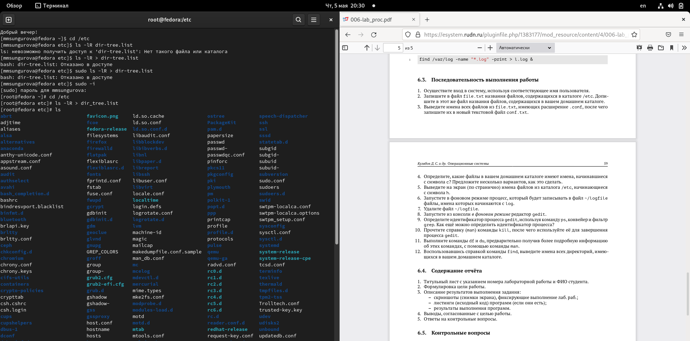
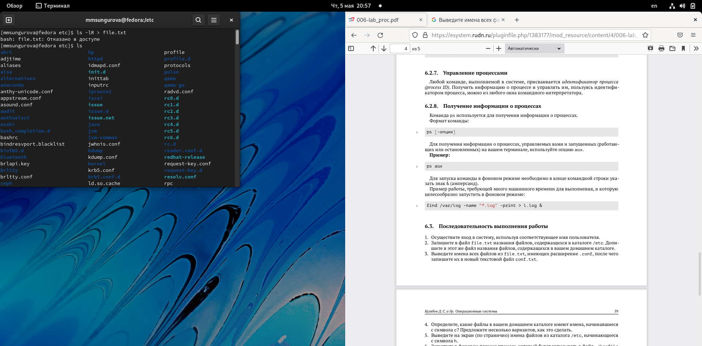
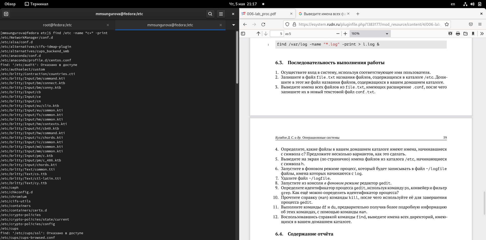
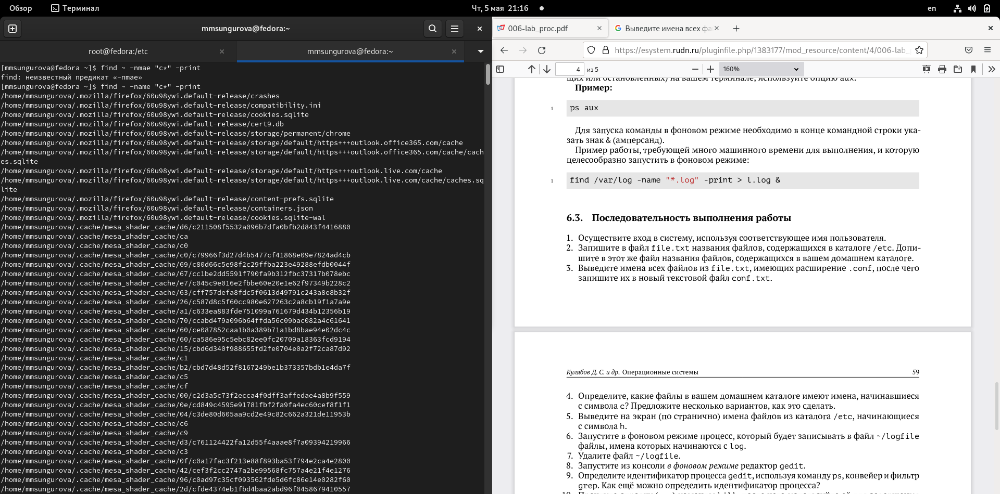
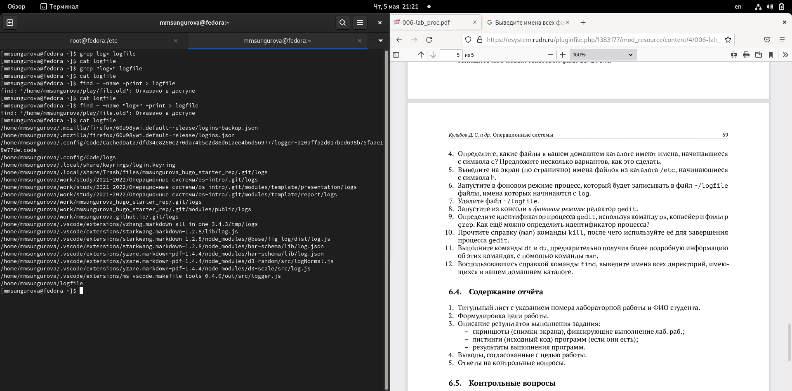
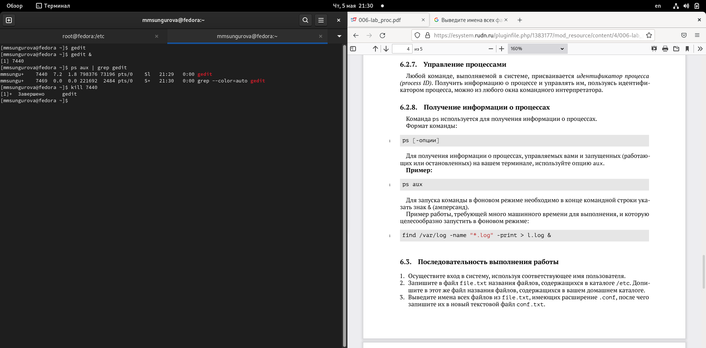
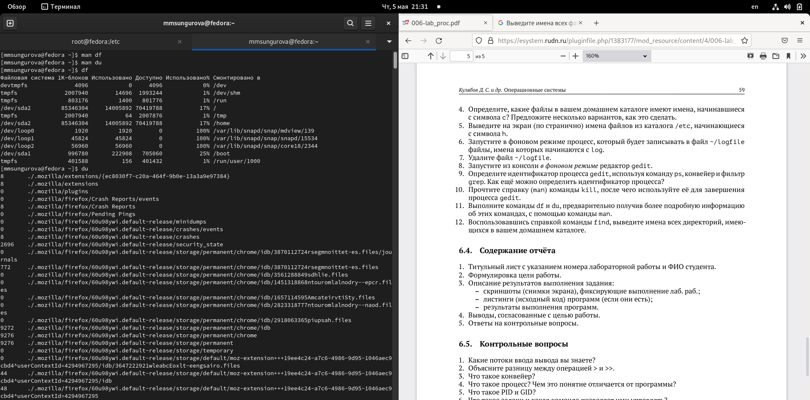
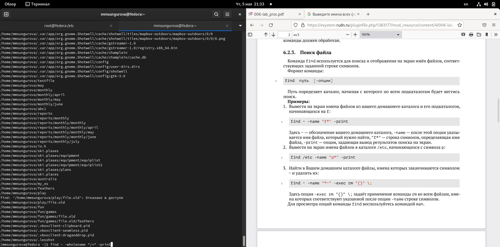

---
## Front matter
lang: ru-RU
title: Лабораторная работа №6
author: |
	Сунгурова Мариян Мухсиновна, НКНбд-01-21
	

## Formatting
toc: false
slide_level: 2
theme: metropolis
header-includes: 
 - \metroset{progressbar=frametitle,sectionpage=progressbar,numbering=fraction}
 - '\makeatletter'
 - '\beamer@ignorenonframefalse'
 - '\makeatother'
aspectratio: 43
section-titles: true
---

## Содержание
1. Цель работы
2. Процесс выполнения
3. Вывод
4. Источники

## Цель работы

Ознакомление с инструментами поиска файлов и фильтрации текстовых данных.
Приобретение практических навыков: по управлению процессами (и заданиями), по
проверке использования диска и обслуживанию файловых систем.

## Процесс выполнения

1. Осуществите вход в систему, используя соответствующее имя пользователя.
2. Запишите в файл file.txt названия файлов, содержащихся в каталоге /etc.
 Допишите в этот же файл названия файлов, содержащихся в вашем домашнем каталоге. (рис. [-@fig:001])

{ #fig:001 width=70% }

## Процесс выполнения

3. Выведите имена всех файлов из file.txt, имеющих расширение .conf, после чего
запишите их в новый текстовой файл conf.txt.(рис. [-@fig:002])

{ #fig:002 width=70% }

## Процесс выполнения

4. Определите, какие файлы в вашем домашнем каталоге имеют имена, начинавшиеся
с символа c? Предложите несколько вариантов, как это сделать.(рис. [-@fig:003])

{ #fig:003 width=70% }

## Процесс выполнения

5. Выведите на экран (по странично) имена файлов из каталога /etc, начинающиеся
с символа h.(рис. [-@fig:004])

{ #fig:004 width=70% }

## Процесс выполнения

6. Запустите в фоновом режиме процесс, который будет записывать в файл ~/logfile
файлы, имена которых начинаются с log.(рис. [-@fig:005])

{ #fig:005 width=70% }

## Процесс выполнения

7. Удалите файл ~/logfile.(рис. [-@fig:006])

{ #fig:006 width=70% }

## Процесс выполнения

8. Запустите из консоли в фоновом режиме редактор gedit.(рис. [-@fig:007])

{ #fig:007 width=70% }

## Процесс выполнения

9. Определите идентификатор процесса gedit, используя команду ps, конвейер и фильтр
grep. Как ещё можно определить идентификатор процесса?(рис. [-@fig:008])

{ #fig:008 width=70% }

## Процесс выполнения

10. Прочтите справку (man) команды kill, после чего используйте её для завершения
процесса gedit.(рис. [-@fig:009])

{ #fig:009 width=70% }

## Процесс выполнения

11. Выполните команды df и du, предварительно получив более подробную информацию
об этих командах, с помощью команды man.(рис. [-@fig:010])

{ #fig:010 width=70% }

## Процесс выполнения

12. Воспользовавшись справкой команды find, выведите имена всех директорий, имею-
щихся в вашем домашнем каталоге.(рис. [-@fig:011])

{ #fig:011 width=70% }

## Вывод

В результате данной лабораторной работы я ознакомилась с инструментами поиска файлов и 
фильтрации текстовых данных. Приобрела практические навыков: по управлению процессами 
(и заданиями), по проверке использования диска и обслуживанию файловых систем.

## ИСточники

1. КулябовД. С. Введение в операционные системы –Лекция;

