---
## Front matter
lang: ru-RU
title: Лабораторная работа №7
author: |
	Сунгурова Мариян Мухсиновна, НКНбд-01-21
	

## Formatting
toc: false
slide_level: 2
theme: metropolis
header-includes: 
 - \metroset{progressbar=frametitle,sectionpage=progressbar,numbering=fraction}
 - '\makeatletter'
 - '\beamer@ignorenonframefalse'
 - '\makeatother'
aspectratio: 43
section-titles: true
---

## Содержание
1. Цель работы
2. Процесс выполнения
3. Вывод
4. Источники

## Цель работы

Освоение основных возможностей командной оболочки Midnight Commander. Приоб-
ретение навыков практической работы по просмотру каталогов и файлов; манипуляций
с ними.

## Процесс выполнения

1. Изучите информацию о mc, вызвав в командной строке man mc.(рис. [-@fig:001])

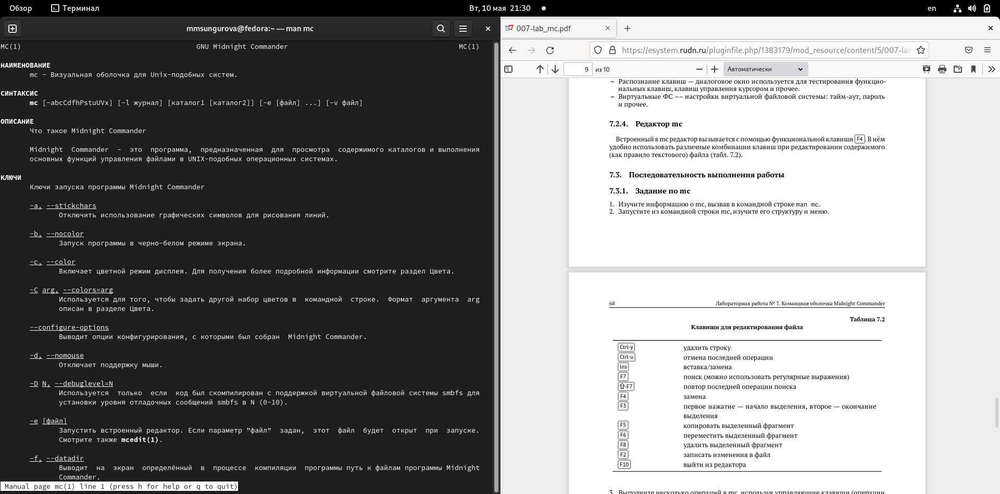{ #fig:001 width=70% }

## Процесс выполнения

2. Запустите из командной строки mc, изучите его структуру и меню. (рис. [-@fig:002])

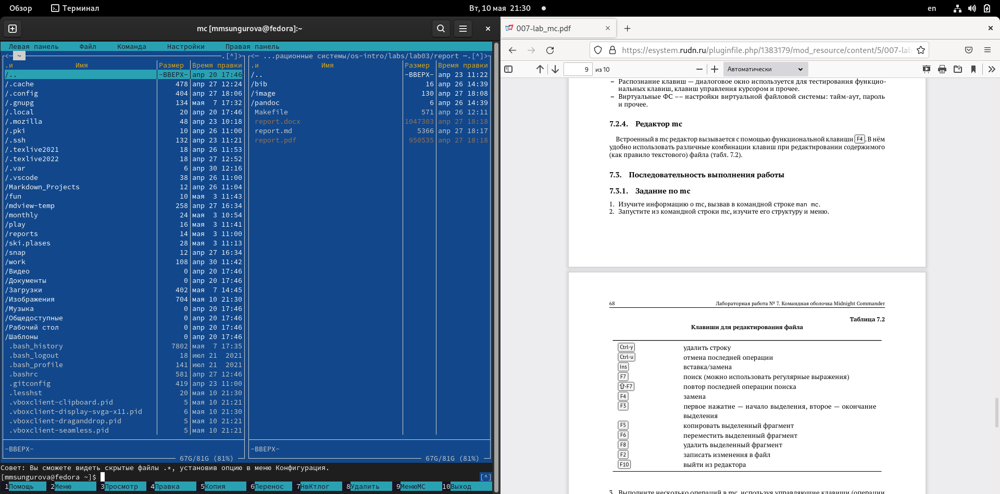{ #fig:002 width=70% }

## Процесс выполнения

3. Выполните несколько операций в mc, используя управляющие клавиши (операции
с панелями; выделение/отмена выделения файлов, копирование/перемещение фай-
лов, получение информации о размере и правах доступа на файлы и/или каталоги
и т.п.)(рис. [-@fig:003])

{ #fig:003 width=70% }

## Процесс выполнения

4. Выполните основные команды меню левой (или правой) панели. Оцените степень
подробности вывода информации о файлах.(рис. [-@fig:004])

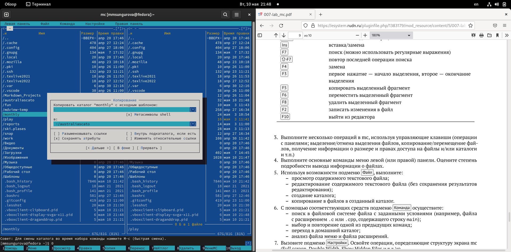{ #fig:004 width=70% }

## Процесс выполнения

5. Используя возможности подменю Файл , выполните:
- просмотр содержимого текстового файла;
- редактирование содержимого текстового файла (без сохранения результатов
редактирования);
- создание каталога;
- копирование в файлов в созданный каталог.(рис. [-@fig:005])

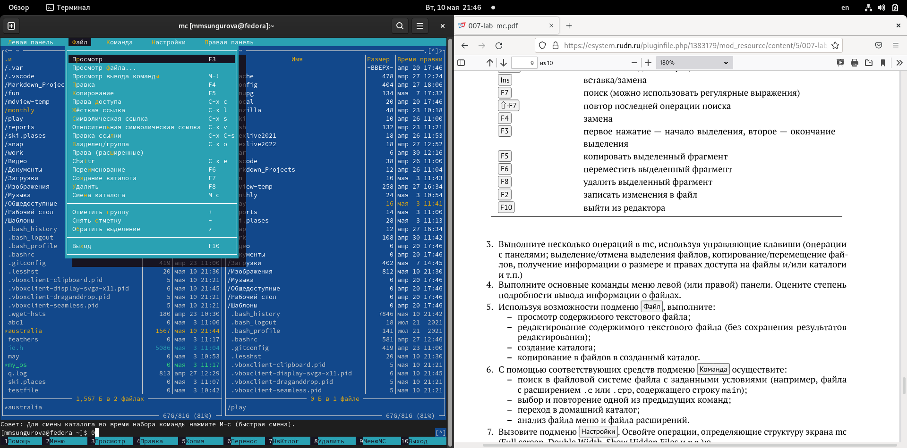{ #fig:005 width=70% }

## Процесс выполнения

6.  С помощью соответствующих средств подменю Команда осуществите:
– поиск в файловой системе файла с заданными условиями (например, файла
с расширением .c или .cpp, содержащего строку main);
– выбор и повторение одной из предыдущих команд;
– переход в домашний каталог;
– анализ файла меню и файла расширений.(рис. [-@fig:006 ; -@fig:007; -@fig:008 ])

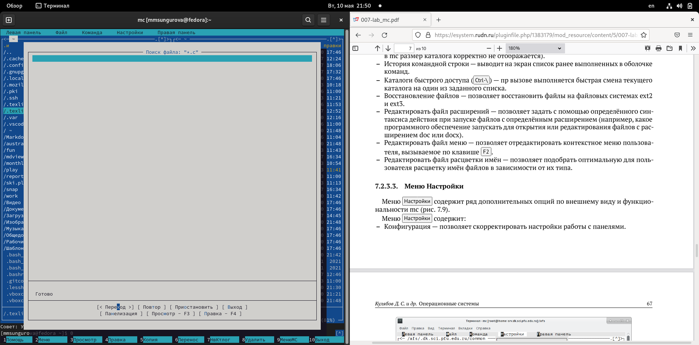{ #fig:006 width=70% }

## Процесс выполнения

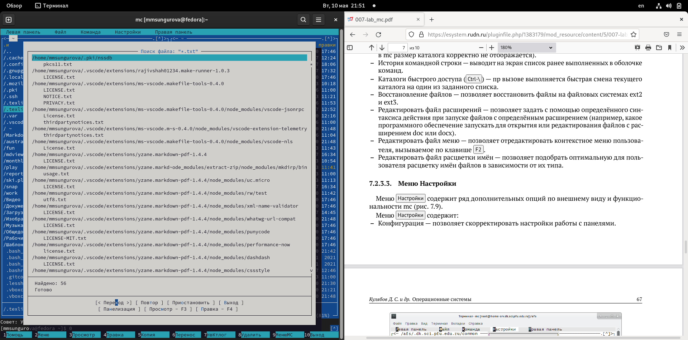{ #fig:007 width=70% }

## Процесс выполнения

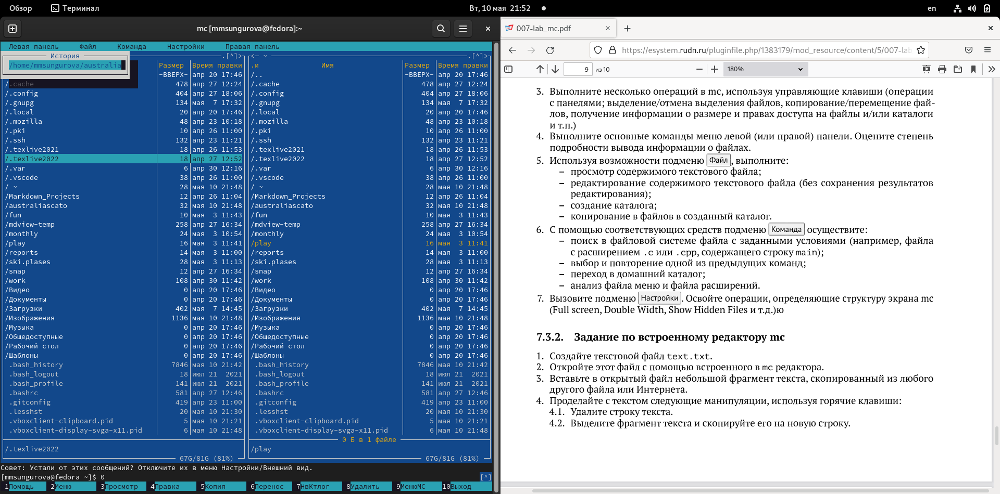{ #fig:008 width=70% }

## Процесс выполнения

7. Вызовите подменю Настройки . Освойте операции, определяющие структуру экрана mc
(Full screen, Double Width, Show Hidden Files и т.д.) 
(рис. [-@fig:009])

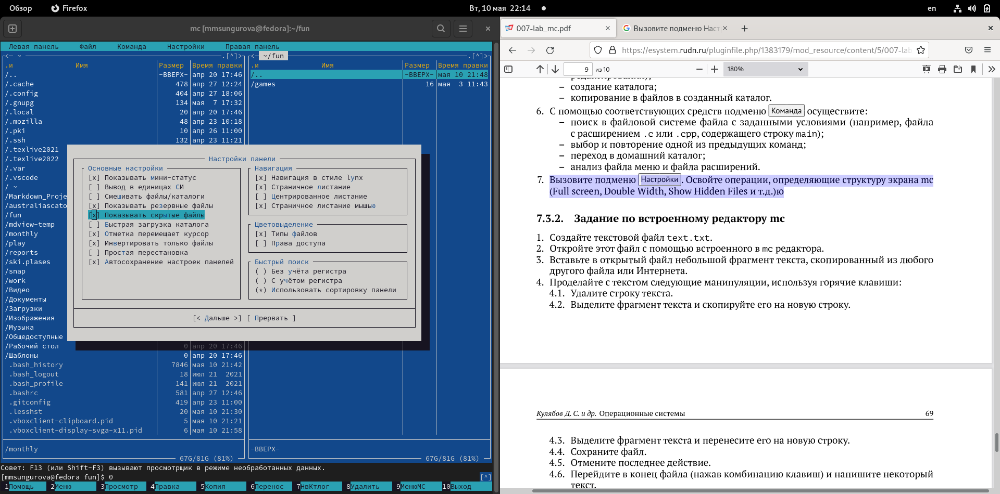{ #fig:009 width=70% }

## Процесс выполнения

1. Создайте текстовой файл text.txt.(рис. [-@fig:010])

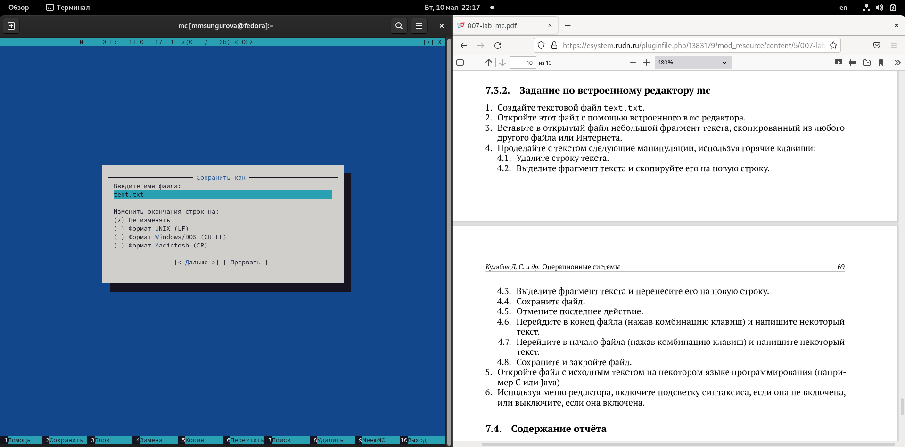{ #fig:010 width=70% }

## Процесс выполнения

2. Откройте этот файл с помощью встроенного в mc редактора.(рис. [-@fig:011])

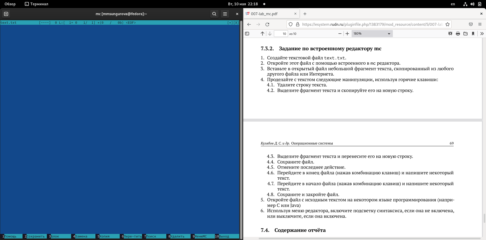{ #fig:011 width=70% }

## Процесс выполнения

3. Вставьте в открытый файл небольшой фрагмент текста, скопированный из любого
другого файла или Интернета.(рис. [-@fig:012])

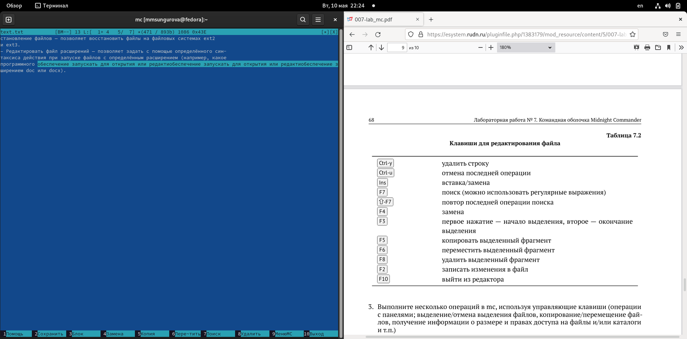{ #fig:012 width=70% }

## Процесс выполнения

4. Проделайте с текстом следующие манипуляции, используя горячие клавиши:
		4.1. Удалите строку текста.
		4.2. Выделите фрагмент текста и скопируйте его на новую строку.
		4.3. Выделите фрагмент текста и перенесите его на новую строку.
		4.4. Сохраните файл.
		4.5. Отмените последнее действие.
		4.6. Перейдите в конец файла (нажав комбинацию клавиш) и напишите некоторый текст.
		4.7. Перейдите в начало файла (нажав комбинацию клавиш) и напишите некоторый текст.
		4.8. Сохраните и закройте файл.
		
## Процесс выполнения
5. Откройте файл с исходным текстом на некотором языке программирования (напри-
мер C или Java)(рис. [-@fig:013])

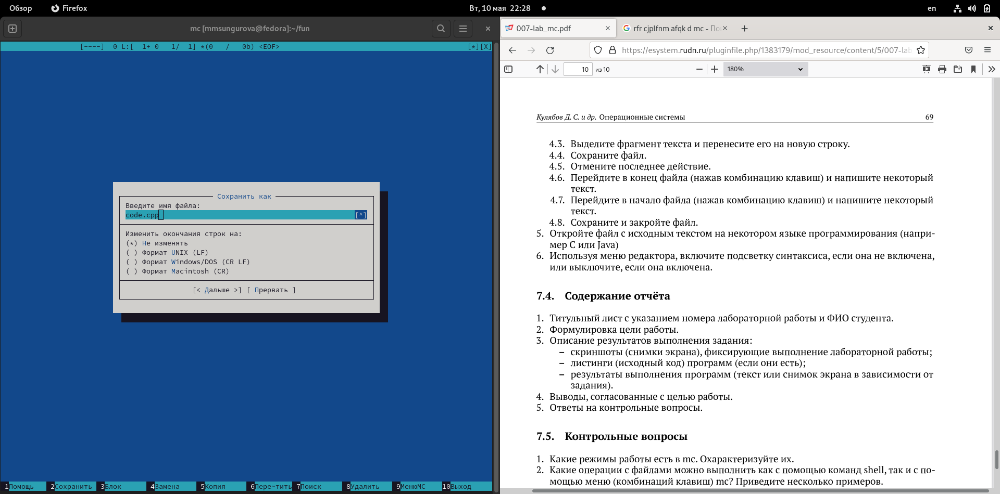{ #fig:013 width=70% }

## Процесс выполнения

6. Используя меню редактора, включите подсветку синтаксиса, если она не включена,
или выключите, если она включена.(рис. [-@fig:014])

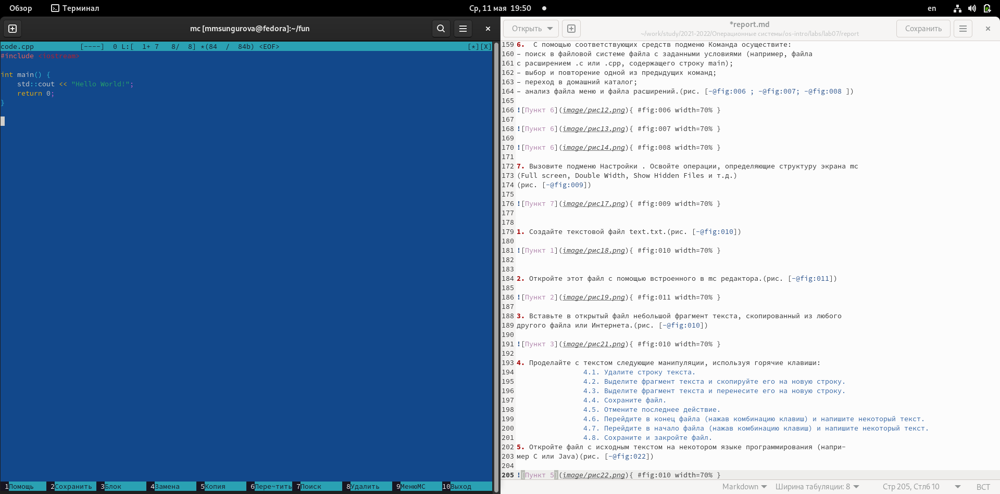{ #fig:014 width=70% }

## Вывод

В результате данной лабораторной работы я освоила основные возможности командной оболочки Midnight Commander. 
Приобретела навыки практической работы по просмотру каталогов и файлов; манипуляций
с ними

## Иcточники

1. КулябовД. С. Введение в операционные системы –Лекция;

