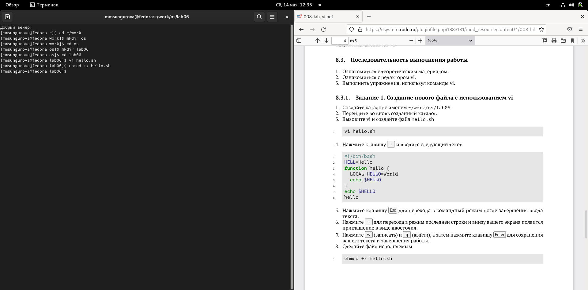
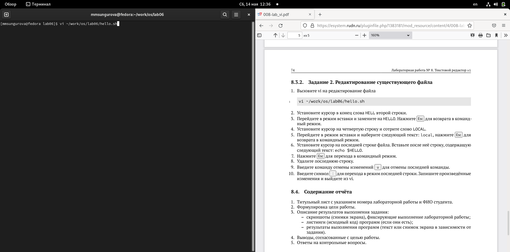

---
## Front matter
title: "Лаборатоная работа №7"
subtitle: "Командная оболочка Midnight Commander"
author: "Сунгурова МАриян Мухсиновна НКНбд-01-21"

## Generic otions
lang: ru-RU
toc-title: "Содержание"

## Bibliography
bibliography: bib/cite.bib
csl: pandoc/csl/gost-r-7-0-5-2008-numeric.csl

## Pdf output format
toc: true # Table of contents
toc-depth: 2
lof: true # List of figures
lot: false # List of tables
fontsize: 12pt
linestretch: 1.5
papersize: a4
documentclass: scrreprt
## I18n polyglossia
polyglossia-lang:
  name: russian
  options:
	- spelling=modern
	- babelshorthands=true
polyglossia-otherlangs:
  name: english
## I18n babel
babel-lang: russian
babel-otherlangs: english
## Fonts
mainfont: PT Serif
romanfont: PT Serif
sansfont: PT Sans
monofont: PT Mono
mainfontoptions: Ligatures=TeX
romanfontoptions: Ligatures=TeX
sansfontoptions: Ligatures=TeX,Scale=MatchLowercase
monofontoptions: Scale=MatchLowercase,Scale=0.9
## Biblatex
biblatex: true
biblio-style: "gost-numeric"
biblatexoptions:
  - parentracker=true
  - backend=biber
  - hyperref=auto
  - language=auto
  - autolang=other*
  - citestyle=gost-numeric
## Pandoc-crossref LaTeX customization
figureTitle: "Рис."
tableTitle: "Таблица"
listingTitle: "Листинг"
lofTitle: "Список иллюстраций"
lotTitle: "Список таблиц"
lolTitle: "Листинги"
## Misc options
indent: true
header-includes:
  - \usepackage{indentfirst}
  - \usepackage{float} # keep figures where there are in the text
  - \floatplacement{figure}{H} # keep figures where there are in the text
---

# Цель работы

Освоение основных возможностей командной оболочки Midnight Commander. Приоб-
ретение навыков практической работы по просмотру каталогов и файлов; манипуляций
с ними.

# Задание

1. Изучите информацию о mc, вызвав в командной строке man mc.
2. Запустите из командной строки mc, изучите его структуру и меню
3. Выполните несколько операций в mc, используя управляющие клавиши (операции
с панелями; выделение/отмена выделения файлов, копирование/перемещение фай-
лов, получение информации о размере и правах доступа на файлы и/или каталоги
и т.п.)
4. Выполните основные команды меню левой (или правой) панели. Оцените степень
подробности вывода информации о файлах.
5. Используя возможности подменю Файл , выполните:
– просмотр содержимого текстового файла;
– редактирование содержимого текстового файла (без сохранения результатов
редактирования);
– создание каталога;
– копирование в файлов в созданный каталог.
6. С помощью соответствующих средств подменю Команда осуществите:
– поиск в файловой системе файла с заданными условиями (например, файла
с расширением .c или .cpp, содержащего строку main);
– выбор и повторение одной из предыдущих команд;
– переход в домашний каталог;
– анализ файла меню и файла расширений.
7. Вызовите подменю Настройки . Освойте операции, определяющие структуру экрана mc
(Full screen, Double Width, Show Hidden Files и т.д.)ю
7.3.2. Задание по встроенному редактору mc
1. Создайте текстовой файл text.txt.
2. Откройте этот файл с помощью встроенного в mc редактора.
3. Вставьте в открытый файл небольшой фрагмент текста, скопированный из любого
другого файла или Интернета.
4. Проделайте с текстом следующие манипуляции, используя горячие клавиши:
4.1. Удалите строку текста.
4.2. Выделите фрагмент текста и скопируйте его на новую строку.
4.3. Выделите фрагмент текста и перенесите его на новую строку.
4.4. Сохраните файл.
4.5. Отмените последнее действие.
4.6. Перейдите в конец файла (нажав комбинацию клавиш) и напишите некоторый
текст.
4.7. Перейдите в начало файла (нажав комбинацию клавиш) и напишите некоторый
текст.
4.8. Сохраните и закройте файл.
5. Откройте файл с исходным текстом на некотором языке программирования (напри-
мер C или Java)
6. Используя меню редактора, включите подсветку синтаксиса, если она не включена,
или выключите, если она включена.

# Теоретическое введение

GNU Midnight Commander (mc, ми́днайт-кома́ндер, «полуночный командир»; ранее назывался «mouseless commander») — один из файловых менеджеров с текстовым интерфейсом типа Norton Commander для UNIX-подобных операционных систем, а также Microsoft Windows и Windows NT, OS/2, macOS (но не Mac OS 9). Создан в 1994 году Мигелем де Икасой.

Midnight Commander (GNU Midnight Commander) является частью проекта GNU[5], и все разработчики передали свои права на программу в пользу Free Software Foundation. 
Более подробно об Unix см. в [@gnu-doc:bash;@newham:2005:bash;@zarrelli:2017:bash;@robbins:2013:bash;@tannenbaum:arch-pc:ru;@tannenbaum:modern-os:ru].

# Выполнение лабораторной работы

1. Изучите информацию о mc, вызвав в командной строке man mc.(рис. [-@fig:001])

{ #fig:001 width=70% }

2. Запустите из командной строки mc, изучите его структуру и меню. (рис. [-@fig:002])

{ #fig:002 width=70% }

3. Выполните несколько операций в mc, используя управляющие клавиши (операции
с панелями; выделение/отмена выделения файлов, копирование/перемещение фай-
лов, получение информации о размере и правах доступа на файлы и/или каталоги
и т.п.)(рис. [-@fig:003])

{ #fig:003 width=70% }

4. Выполните основные команды меню левой (или правой) панели. Оцените степень
подробности вывода информации о файлах.(рис. [-@fig:004])

{ #fig:004 width=70% }

5. Используя возможности подменю Файл , выполните:
- просмотр содержимого текстового файла;
- редактирование содержимого текстового файла (без сохранения результатов
редактирования);
- создание каталога;
- копирование в файлов в созданный каталог.(рис. [-@fig:005])

{ #fig:005 width=70% }

6.  С помощью соответствующих средств подменю Команда осуществите:
– поиск в файловой системе файла с заданными условиями (например, файла
с расширением .c или .cpp, содержащего строку main);
– выбор и повторение одной из предыдущих команд;
– переход в домашний каталог;
– анализ файла меню и файла расширений.(рис. [-@fig:006 ; -@fig:007; -@fig:008 ])

{ #fig:006 width=70% }

{ #fig:007 width=70% }

{ #fig:008 width=70% }

7. Вызовите подменю Настройки . Освойте операции, определяющие структуру экрана mc
(Full screen, Double Width, Show Hidden Files и т.д.) 
(рис. [-@fig:009])

{ #fig:009 width=70% }

1. Создайте текстовой файл text.txt.(рис. [-@fig:010])

{ #fig:010 width=70% }

2. Откройте этот файл с помощью встроенного в mc редактора.(рис. [-@fig:011])

{ #fig:011 width=70% }

3. Вставьте в открытый файл небольшой фрагмент текста, скопированный из любого
другого файла или Интернета.(рис. [-@fig:012])

{ #fig:012 width=70% }

4. Проделайте с текстом следующие манипуляции, используя горячие клавиши:
		4.1. Удалите строку текста.
		4.2. Выделите фрагмент текста и скопируйте его на новую строку.
		4.3. Выделите фрагмент текста и перенесите его на новую строку.
		4.4. Сохраните файл.
		4.5. Отмените последнее действие.
		4.6. Перейдите в конец файла (нажав комбинацию клавиш) и напишите некоторый текст.
		4.7. Перейдите в начало файла (нажав комбинацию клавиш) и напишите некоторый текст.
		4.8. Сохраните и закройте файл.
5. Откройте файл с исходным текстом на некотором языке программирования (напри-
мер C или Java)(рис. [-@fig:013])

{ #fig:013 width=70% }

6. Используя меню редактора, включите подсветку синтаксиса, если она не включена,
или выключите, если она включена.(рис. [-@fig:014])

{ #fig:014 width=70% }

# Выводы

В результате данной лабораторной работы я освоила основные возможности командной оболочки Midnight Commander. Приобретела навыки практической работы по просмотру каталогов и файлов; манипуляций
с ними.

# Контрольные вопросы 

1. Меню Left и Right

С помощью этих окон можно менять режимы отображения панелей.

Режим просмотра файлов... Этот режим используется для просмотра списка файлов. Существует четыре таких режима: Full, Brief, Long и User. В режиме Full отображается имя файла, размер файла и время последней модификации.

В режиме Brief список файлов располагается в две колонки и состоит только из имён файлов (поэтому в этом режиме отображается наибольшее количество файлов, по сравнению с другими режимами). Режим Long идентичен результату выполнения команды ls -l. В этом режиме панель занимает весь экран. 

2.  Меню пользователя (F2)

Вызывает меню пользователя. Меню пользователя предоставляет простой способ расширения возможностей Midnight Commander за счет добавления в личное меню пользователя вызова часто используемых программ.

Просмотр файла (F3, Shift-F3)

Просмотреть файл, на который указывает подсветка. По умолчанию при этом вызывается встроенная программа просмотра, но, сняв отметку с опции "Встроенный просмотр" ("Use internal view") в пункте "Конфигурация" меню "Настройки" ("Options"), можно вызывать внешнюю программу просмотра, путь к которой должен быть указан в переменной окружения PAGER. Если переменная PAGER не определена, вызывается встроенная программа. Если вместо F3 нажать Shift-F3, встроенная программа просмотра не выполняет предварительного форматирования или обработки файла.

Просмотр вывода команды (Filtered View) (M-!)

По этой команде на экране появляется строка ввода, в которой вы можете ввести любую команду с параметрами (по умолчанию предлагается использовать в качестве параметра имя подсвеченного файла). Вывод этой команды будет отображаться на экране через встроенную программу просмотра.

Редактирование (F4)

Вызывается редактор vi, либо редактор, указанный в переменной окружения EDITOR, либо встроенный редактор файлов (если включена опция "Встроенный редактор" (use_internal_edit) в меню "Настройки / Конфигурация").

Копирование (F5)

Вызывается диалоговое окно, в котором предлагается скопировать подсвеченный файл из каталога, отображаемого в активной панели (или группу отмеченных файлов, если в активной панели отмечен хотя бы один файл) в каталог, отображаемый в пассивной панели. Имя каталога, в который будет производиться копирование, можно изменить. О том, как задать шаблон для имен копируемых файлов (обычно это * или ^\(.*\)$, в зависимости от установки опции Образцы в стиле shell (Shell Patterns), и о допустимых символах замены (wildcards) в строке целевого каталога вы можете узнать, просмотрев раздел Маски файлов для операций копирования/переименования.

В процессе выполнения копирования можно нажать C-c или ESC для того, чтобы прервать выполнение операции.

В некоторых системах можно осуществлять копирование в фоновом режиме, если запустить процесс не кнопкой <Дальше> диалогового окна, а кнопкой <На фоне> (или нажав M-b в диалоговом окне). Используя пункт меню "Команды/Фоновые задания", можно управлять выполнением фоновых процессов.

Права доступа (C-x c)

Позволяет изменить права доступа к выделенному или помеченным файлам. 

3. Если Вы хотите узнать, как изменить вид и назачение панелей, просмотрите разделы 'МЕНЮ Left' и 'МЕНЮ Right'.

    Tab, C-i меняет текущую панель. Бывшая неактивная панель становится активной, а бывшая активная становится неактивной. Выделитель перемещается в соседнюю панель.

    Insert, C-t для пометки файлов используется клавиша Insert (kich1 terminfo последовательность) или C-t (Control-t). Для снятия пометки следует пометить помеченные файлы ещё раз.

    A-g, A-h(или A-r), A-j используется для выбора в панели первого, среднего и последнего файлов.

    C-s, A-s поиск имени файла в списке. Каждое новое нажатие клавиши приводит к изменению шаблона поиска. Если опция отображения мини-статуса установлена, то в ней будет виден образец поиска. При наборе, выделитель будет перемещаться к следующему файлу, имя которого начинается с шаблона. Клавишами Backspace и Del можно исправлять допущенные ошибки. Ещё одно нажатие C-s приведёт к новому поиску.

    C-\ (Control-бэк слэш) отображает горячий список каталогов и меняет текущий каталог на выбранный.

    + (плюс) эта клавиша используется для пометки группы файлов. MC выдаст диалоговое окно для ввода регулярного выражения, описывающего группу помечаемых файлов. Если установлена опция использования шаблонов оболочки, то регулярное выражение должно соответствовать стандартам оболочки (т.е. '*' используется для указания нуля или более символов и '?' для одного символа). Если же эта опция не установлена, то при пометке файлов используются обычные регулярные выражения (см. ed (1)).

4. В меню Файл содержит перечень команд, которые могут быть применены к одному
или нескольким файлам или каталогам.
Команды меню Файл :
– Просмотр ( F3 ) — позволяет посмотреть содержимое текущего (или выделенного)
файла без возможности редактирования.
– Просмотр вывода команды ( М + ! ) — функция запроса команды с параметрами
(аргумент к текущему выбранному файлу).
– Правка ( F4 ) — открывает текущий (или выделенный) файл для его редактирования.
– Копирование ( F5 ) — осуществляет копирование одного или нескольких файлов или
каталогов в указанное пользователем во всплывающем окне место.
– Права доступа ( Ctrl-x c ) — позволяет указать (изменить) права доступа к одному
или нескольким файлам или каталогам 

5. В меню Команда содержатся более общие команды для работы с mc (рис. 7.8).
Команды меню Команда :
– Дерево каталогов — отображает структуру каталогов системы.
– Поиск файла — выполняет поиск файлов по заданным параметрам.
– Переставить панели — меняет местами левую и правую панели.
– Сравнить каталоги ( Ctrl-x d ) — сравнивает содержимое двух каталогов.
– Размеры каталогов — отображает размер и время изменения каталога (по умолчанию
в mc размер каталога корректно не отображается).
– История командной строки — выводит на экран список ранее выполненных в оболочке
команд.
– Каталоги быстрого доступа ( Ctrl-\ ) — пр вызове выполняется быстрая смена текущего
каталога на один из заданного списка.
– Восстановление файлов — позволяет восстановить файлы на файловых системах ext2
и ext3.
– Редактировать файл расширений — позволяет задать с помощью определённого син-
таксиса действия при запуске файлов с определённым расширением (например, какое
программного обеспечение запускать для открытия или редактирования файлов с рас-
ширением doc или docx).
– Редактировать файл меню — позволяет отредактировать контекстное меню пользова-
теля, вызываемое по клавише F2 .
– Редактировать файл расцветки имён — позволяет подобрать оптимальную для поль-
зователя расцветку имён файлов в зависимости от их типа.

6. Меню Настройки содержит ряд дополнительных опций по внешнему виду и функцио-
нальности mc.
Меню Настройки содержит:
– Конфигурация — позволяет скорректировать настройки работы с панелями.
– Внешний вид и Настройки панелей — определяет элементы (строка меню, команд-
ная строка, подсказки и прочее), отображаемые при вызове mc, а также геометрию
расположения панелей и цветовыделение.
– Биты символов — задаёт формат обработки информации локальным терминалом.
– Подтверждение — позволяет установить или убрать вывод окна с запросом подтвер-
ждения действий при операциях удаления и перезаписи файлов, а также при выходе
из программы.
– Распознание клавиш — диалоговое окно используется для тестирования функцио-
нальных клавиш, клавиш управления курсором и прочее.
– Виртуальные ФС –– настройки виртуальной файловой системы: тайм-аут, пароль
и прочее.

7. F1 – Help! (помощь, подсказка)

F2 – вызов пользовательского меню

F3 – просмотр содержимого файла

F4 – редактирование содержимого файла (в сочетании с кнопкой «shift» - создание нового файла)

F5 – копирование файла/директории

F6 – перенос или переименование файла/директории

F7 – создание новой директории

F8 – удаление файла/директории

F9 – переход в основное меню Midnight Commander

F10 – выход (завершение работы mc)

TAB, Ctrl+I – переход между панелями

Insert, Ctrl+t – выделение файла/директории для каких либо операций над ними (повторное нажатие на выделенном объекте снимает выделение)

8. C-l    Обновляет всю информацию, отображаемую программой Midnight Commander.

       C-x c  Запускает команду Chmod для подсвеченного файла или группы отмеченных файлов.

       C-x o  Запускает команду Chown для подсвеченного файла или группы отмеченных файлов.

       C-x l  Запускает команду создания жесткой ссылки.

       C-x s  Запускает команду создания абсолютной символической ссылки.

       C-x v  Запускает команду создания относительной символической ссылки.  Для более детальной
              информации о ссылках смотрите раздел Меню Файл

       C-x i  Переводит пассивную панель в режим "Информация".

       C-x q  Переводит пассивную панель в режим быстрого просмотра.

       C-x !  Выполняется пункт меню "Критерий панелизации".

       C-x h  Добавить имя каталога в "Каталоги быстрого доступа".

       M-!    Выполняет  пункт меню "Просмотр вывода команды", который описан подробнее в разделе
              "Меню "Файл".

       M-?    Вызов диалогового окна "Поиск файла".

       M-c    Вызов диалогового окна "Быстрая смена каталога".

       C-o    Если Midnight Commander запущен в консоли Linux или FreeBSD, или через  xterm,  вам
              будет  показан  вывод  предыдущей  команды.  При  этом  на  Linux-консоли  Midnight
              Commander использует встроенную программу  (cons.saver)  для  сохранения  выводимой
              информации и демонстрации ее на экране.
9. Меню пользователя – это меню, состоящее из команд, определенных пользователем. При вызове меню используется файл ~/.mc.menu. Если такого файла нет, то по умолчанию используется системный файл меню /usr/lib/mc/mc.menu. 
    <Tab> или <Ctrl>+<i>. Сменить текущую (активную) панель. Подсветка перемещается с панели, которая была активной ранее, в другую панель, которая становится активной.

    <Alt>+<G> / <Alt>+<R> / <Alt>+<J>. Используются для перемещения подсветки, соответственно, на самый верхний, средний или нижний файл из числа отображаемых в данный момент на панели.

    <Alt>+<T>. Циклически переключает режимы отображения списка файлов текущей директории. С помощью этой комбинации клавиш можно быстро переключаться из режима стандартного вывода (long listing) к сокращенному или к режиму, определяемому пользователем.

    <Ctrl>+<\>. Показать справочник каталогов и перейти к выбранному каталогу.

    <Home> или <Alt>+<’<’>. Перемещает подсветку на первую позицию списка файлов (здесь я вынужден отойти от соглашения об обозначении клавиш).

    <End>, <Alt>+<‘>'>. Перемещает подсветку на последнюю позицию списка файлов.

    <Alt>+<O>. Если в активной панели подсвечено имя каталога, а на второй панели отображается список файлов, то вторая панель переходит в режим отображения файлов подсвеченного каталога. Если в активной панели подсветка указывает на файл, то во второй панели отображается содержимое каталога, родительского по отношению к текущему.

    <Ctrl>+<PageUp>, <Ctrl>+<PageDown>. Только если mc запущен с консоли Linux: выполняется, соответственно, переход (chdir) к родительскому каталогу ("..") или к выделенному подсветкой каталогу.

    <Alt>+<Y>. Перемещение к предыдущему каталогу из истории перемещения по каталогам; эквивалентно нажатию мышкой на символ '<' в верхнем углу панели.

    <Alt>+<U>. Перемещение к следующему каталогу из истории перемещения по каталогам; эквивалентно нажатию мышкой на символ '>'.
10.  C-a Перемещает курсор в началу строки.

       C-e Перемещает курсор в конец строки.

       C-b, стрелка-влево Перемещает курсор на одну позицию влево.

       C-f, стрелка-вправо Перемещает курсор на одну позицию вправо.

       M-f Перемещает курсор на одно слово вперед.

       M-b Перемещает курсор на одно слово назад.

       C-h, Backspace Удаляет символ, предшествующий курсору.

       C-d, Delete Удаляет символ в позиции курсора.

       C-@ Устанавливает метку для того, чтобы вырезать (скопировать в буфер) часть текста.

       C-w Копирует текст, расположенный между курсором и меткой, в буфер, удаляя текст из строки
       ввода.

       M-w Копирует текст, расположенный между курсором и меткой, в буфер.

       C-y Вставляет содержимое буфера в строку ввода перед позицией курсора.

       C-k Удаляет текст от курсора до конца строки.

       M-p, M-n Эти комбинации используются для перемещения по истории команд. M-p  перемещает  к
       предыдущей команде, M-n - к следующей.

       M-C-h, M-Backspace Удалить предшествующее слово.

       M-Tab  Пытается  выполнить завершение ввода (completion) имени файла, команды, переменной,
       имени пользователя или имени машины.

# Список литературы{.unnumbered}

::: {#refs}
:::
