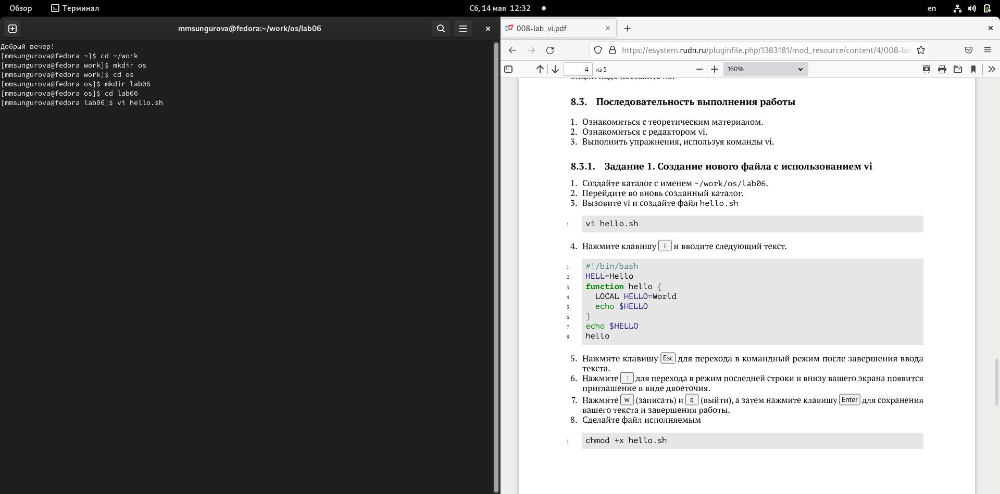
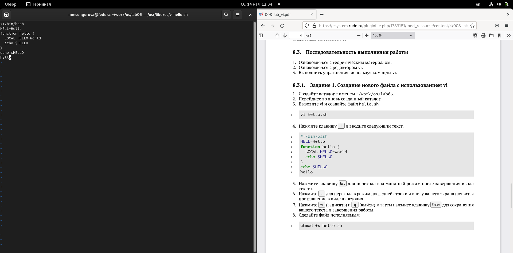
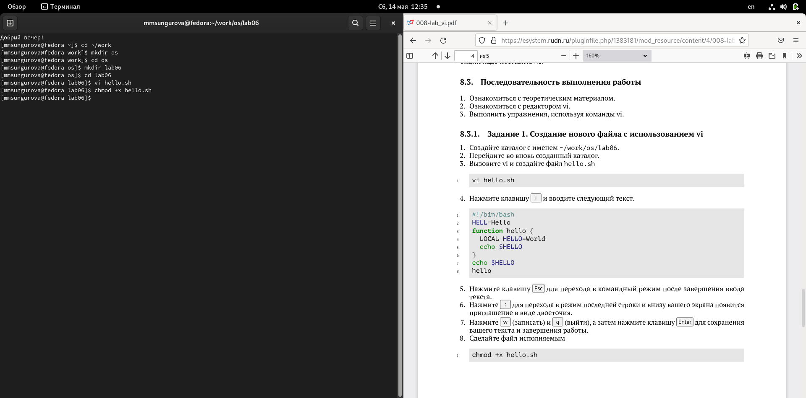
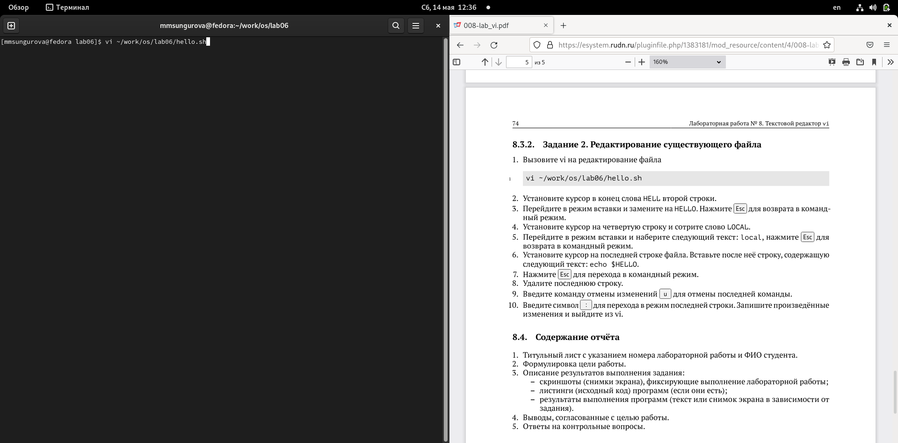

---
## Front matter
title: "Лаборатоная работа №8"
subtitle: "Текстовой редактор vi"
author: "Сунгурова МАриян Мухсиновна НКНбд-01-21"

## Generic otions
lang: ru-RU
toc-title: "Содержание"

## Bibliography
bibliography: bib/cite.bib
csl: pandoc/csl/gost-r-7-0-5-2008-numeric.csl

## Pdf output format
toc: true # Table of contents
toc-depth: 2
lof: true # List of figures
lot: false # List of tables
fontsize: 12pt
linestretch: 1.5
papersize: a4
documentclass: scrreprt
## I18n polyglossia
polyglossia-lang:
  name: russian
  options:
	- spelling=modern
	- babelshorthands=true
polyglossia-otherlangs:
  name: english
## I18n babel
babel-lang: russian
babel-otherlangs: english
## Fonts
mainfont: PT Serif
romanfont: PT Serif
sansfont: PT Sans
monofont: PT Mono
mainfontoptions: Ligatures=TeX
romanfontoptions: Ligatures=TeX
sansfontoptions: Ligatures=TeX,Scale=MatchLowercase
monofontoptions: Scale=MatchLowercase,Scale=0.9
## Biblatex
biblatex: true
biblio-style: "gost-numeric"
biblatexoptions:
  - parentracker=true
  - backend=biber
  - hyperref=auto
  - language=auto
  - autolang=other*
  - citestyle=gost-numeric
## Pandoc-crossref LaTeX customization
figureTitle: "Рис."
tableTitle: "Таблица"
listingTitle: "Листинг"
lofTitle: "Список иллюстраций"
lotTitle: "Список таблиц"
lolTitle: "Листинги"
## Misc options
indent: true
header-includes:
  - \usepackage{indentfirst}
  - \usepackage{float} # keep figures where there are in the text
  - \floatplacement{figure}{H} # keep figures where there are in the text
---

# Цель работы

Познакомиться с операционной системой Linux. Получить практические навыки рабо-
ты с редактором vi, установленным по умолчанию практически во всех дистрибутивах.

# Задание

Задание 1. Создание нового файла с использованием vi
1. Создайте каталог с именем ~/work/os/lab06.
2. Перейдите во вновь созданный каталог.
3. Вызовите vi и создайте файл hello.sh
1 vi hello.sh
4. Нажмите клавишу i и вводите следующий текст.
1 #!/bin/bash
2 HELL=Hello
3 function hello {
4 LOCAL HELLO=World
5 echo $HELLO
6 }
7 echo $HELLO
8 hello
5. Нажмите клавишу Esc для перехода в командный режим после завершения ввода
текста.
6. Нажмите : для перехода в режим последней строки и внизу вашего экрана появится
приглашение в виде двоеточия.
7. Нажмите w (записать) и q (выйти), а затем нажмите клавишу Enter для сохранения
вашего текста и завершения работы.
8. Сделайте файл исполняемым

Задание 2. Редактирование существующего файла
1. Вызовите vi на редактирование файла
1 vi ~/work/os/lab06/hello.sh
2. Установите курсор в конец слова HELL второй строки.
3. Перейдите в режим вставки и замените на HELLO. Нажмите Esc для возврата в команд-
ный режим.
4. Установите курсор на четвертую строку и сотрите слово LOCAL.
5. Перейдите в режим вставки и наберите следующий текст: local, нажмите Esc для
возврата в командный режим.
6. Установите курсор на последней строке файла. Вставьте после неё строку, содержащую
следующий текст: echo $HELLO.
7. Нажмите Esc для перехода в командный режим.
8. Удалите последнюю строку.
9. Введите команду отмены изменений u для отмены последней команды.
10. Введите символ : для перехода в режим последней строки. Запишите произведённые
изменения и выйдите из vi.

# Теоретическое введение

vi (от англ. visual, по-русски читается «ви-ай») — серия текстовых редакторов операционных систем семейства UNIX.

Первая версия была написана Биллом Джоем в 1976 году.

В то время наиболее распространённым был редактор ed. Поскольку он был довольно сложным для «простого смертного», George Coulouris разработал редактор em (англ. editor for mortals — «редактор для смертных»). Билл Джой модифицировал редактор em и назвал его en, а позже на его основе создал ex, в котором появился визуальный режим, вызывавшийся командой vi. Так как пользователи больше времени проводили в визуальном режиме, ex 2.0, ставший частью 2BSD, сразу запускался уже в нём. Так появился vi, бывший в то время всего лишь жёсткой ссылкой на ex[3].

Редактор писался для терминала ADM-3A, имевшего ограниченную клавиатуру: на ней не было выделенных клавиш-стрелок, а из модификаторов доступны только ⇧ Shift и частично Ctrl[прим 1]. Эти обстоятельства повлияли на выбор используемых в редакторе клавиш. 
Более подробно об Unix см. в [@gnu-doc:bash;@newham:2005:bash;@zarrelli:2017:bash;@robbins:2013:bash;@tannenbaum:arch-pc:ru;@tannenbaum:modern-os:ru].

# Выполнение лабораторной работы

Задание 1. Создание нового файла с использованием vi

1. Создала каталог с именем ~/work/os/lab06.(рис. [-@fig:001])

{ #fig:001 width=70% }

2. Перешла во вновь созданный каталог.(рис. [-@fig:002])

{ #fig:002 width=70% }

3. Вызвала vi и создайте файл hello.sh
1 vi hello.sh(рис. [-@fig:003])

{ #fig:003 width=70% }

4. Нажала клавишу i и ввела следующий текст.
1 #!/bin/bash
2 HELL=Hello
3 function hello {
4 LOCAL HELLO=World
5 echo $HELLO
6 }
7 echo $HELLO
8 hello(рис. [-@fig:004])

{ #fig:004 width=70% }

5. Нажала клавишу Esc для перехода в командный режим после завершения ввода
текста.(рис. [-@fig:005])

{ #fig:005 width=70% }

6. Нажала : для перехода в режим последней строки и внизу моего экрана появилось
приглашение в виде двоеточия.(рис. [-@fig:006])

{ #fig:006 width=70% }

7. Нажала w (записать) и q (выйти), а затем нажала клавишу Enter для сохранения
вашего текста и завершения работы.
8. Сделала файл исполняемым(рис. [-@fig:007])

{ #fig:007 width=70% }

Задание 2. Редактирование существующего файла
1. Вызвала vi на редактирование файла
1 vi ~/work/os/lab06/hello.sh(рис. [-@fig:008])

{ #fig:008 width=70% }

2. Установила курсор в конец слова HELL второй строки.
3. Перешла в режим вставки и замените на HELLO. Нажала Esc для возврата в команд-
ный режим.
4. Установила курсор на четвертую строку и стерла слово LOCAL.
5. Перешла в режим вставки и набрала следующий текст: local, нажала Esc для
возврата в командный режим.
6. Установила курсор на последней строке файла. Вставьте после неё строку, содержащую
следующий текст: echo $HELLO.
7. Нажала Esc для перехода в командный режим.
8. Удалила последнюю строку.(рис. [-@fig:009])

{ #fig:009 width=70% }

9. Ввела команду отмены изменений u для отмены последней команды.
10. Ввела символ : для перехода в режим последней строки. Записала произведённые
изменения и выйдите из vi.

# Выводы

В результате данной лабораторной работры я познакомилась с операционной системой Linux, получила практические навыки работы с редактором vi, установленным по умолчанию практически во всех дистрибутивах.

# Контрольные вопросы 

1. В любой момент при работе в редакторе vi вы находитесь в одном из трёх режимов редактора: командный режим (command mode), режим ввода (insert mode) и режим последней строки (last line mode).

══ При запуске редактора vi вы оказываетесь в командном режиме. В этом режиме можно давать команды для редактирования файлов или перейти в другой режим. Например, вводя x в командном режиме мы удаляем символ, на который указывает курсор. Клавиши-стрелки перемещают курсор по редактируемому файлу. Как правило, команды, используемые в командном режиме, состоят из одного или двух символов.

════ Основной ввод и редактирование текста осуществляется в режиме ввода. При использовании редактора vi основное время, скорее всего, будет проводиться именно в этом режиме. Переход в режим ввода из командного режима осуществляется командой i (от слова insert). Находясь в режиме ввода, можно вводить текст в то место, куда указывает курсор. Выход из режима ввода в командный режим осуществляется клавишей Esc.

══Режим последней строки═ — это специальный режим, в котором редактору даются сложные команды. При вводе этих команд они отображаются в последней строке экрана (отсюда пошло название режима). Например, если ввести в командном режиме команду :, то осуществится переход в режим последней строки, и можно будет вводить такие команды, как wq (записать файл и покинуть редактор vi) или q! (выйти из редактора vi без сохранения изменений). В режиме последней строки обычно вводятся команды, название которых состоит из нескольких символов. В этом режиме в последнюю строку вводится команда, после чего нажимается клавиша Enter, и команда исполняется.

2.  Воспользоваться командой :, а затем ввести q

3. Команды позиционирования
– 0 (ноль) — переход в начало строки;
– $ — переход в конец строки;
– G — переход в конец файла;
– 𝑛 G — переход на строку с номером 𝑛.

4. При осуществлении перемещения по тексту при помощи команд w, e, b, следует отметить, что, например, «слово» /dev/sda3 редактор определит как 4 различных слова. Чтобы это слово считалось как одно «большое слово», необходимо вводить команды заглавными буквами: W, E, B.

5. – 0 (ноль) — переход в начало строки;
– $ — переход в конец строки;
– G — переход в конец файла;
– 𝑛 G — переход на строку с номером 𝑛.
– а — вставить текст после курсора;
– А — вставить текст в конец строки;
– i — вставить текст перед курсором;
– 𝑛 i — вставить текст 𝑛 раз;
– I — вставить текст в начало строки.

6. Команды управления курсором, Команды позиционирования, Команды перемещения по файлу, Команды перемещения по словам, Команды редактирования, Команды редактирования в режиме командной строки
   
7. Скопировать 𝑛 строк в буфер при помощи клавиш nY, затем вставить текст из буфера обмена при помощи клавиши р.

8. – u — отменить последнее изменение

9. Переход в командный режим осуществляется нажатием клавиши Esc . Для выхода из
редактора vi необходимо перейти в режим последней строки: находясь в командном
режиме, нажать Shift-; (по сути символ : — двоеточие), затем:
– набрать символы wq, если перед выходом из редактора требуется записать изменения
в файл;
– набрать символ q (или q!), если требуется выйти из редактора без сохранения.

10.   $ — переход в конец строки;

11. Опции редактора vi позволяют настроить рабочую среду. Для задания опций использу-
ется команда set (в режиме последней строки):
– : set all — вывести полный список опций;
– : set nu — вывести номера строк;
– : set list — вывести невидимые символы;
– : set ic — не учитывать при поиске, является ли символ прописным или строчным.
Если вы хотите отказаться от использования опции, то в команде set перед именем
опции надо поставить no

12. В редакторе vi есть два основных режима: командный режим и режим вставки. По умолчанию работа начинается в командном режиме. В режиме вставки клавиатура используется для набора текста. Для выхода в командный режим используется клавиша Esc или комбинация Ctrl + c .
 
# Список литературы{.unnumbered}

::: {#refs}
:::
