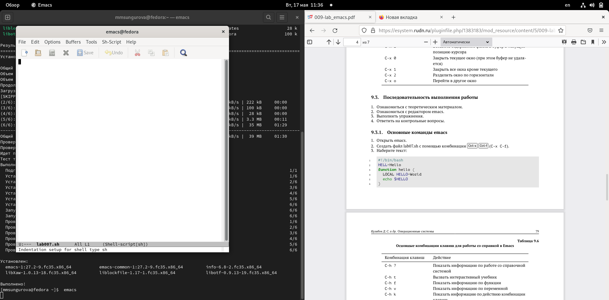
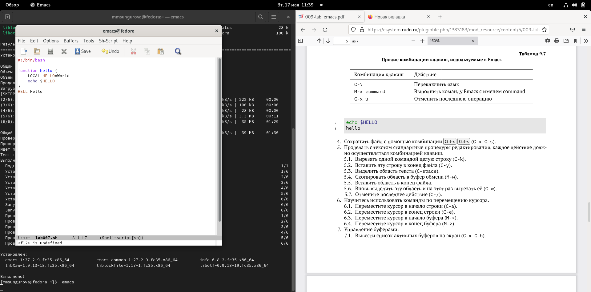
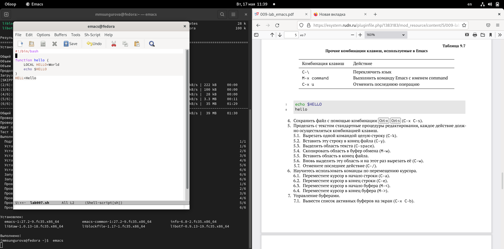
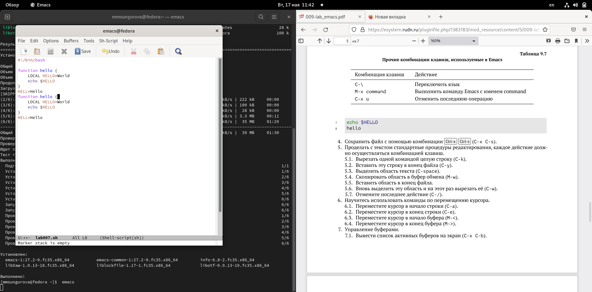
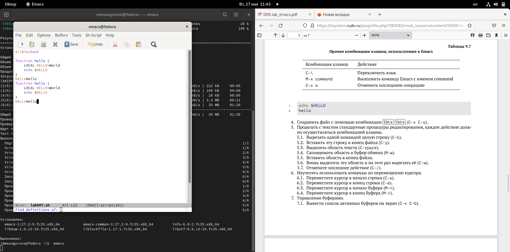
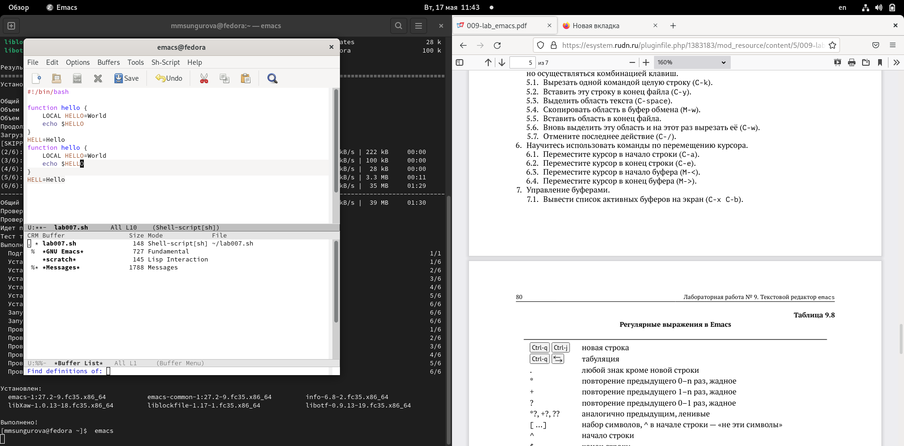
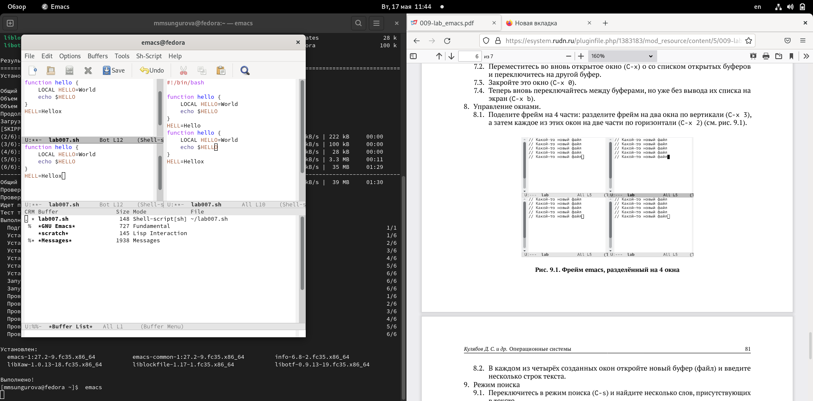

---
## Front matter
title: "Лабораторная работа №9"
subtitle: "Текстовый редактор emacs"
author: "Сунгурова Мариян Мухсиновна"

## Generic otions
lang: ru-RU
toc-title: "Содержание"

## Bibliography
bibliography: bib/cite.bib
csl: pandoc/csl/gost-r-7-0-5-2008-numeric.csl

## Pdf output format
toc: true # Table of contents
toc-depth: 2
lof: true # List of figures
lot: false # List of tables
fontsize: 12pt
linestretch: 1.5
papersize: a4
documentclass: scrreprt
## I18n polyglossia
polyglossia-lang:
  name: russian
  options:
	- spelling=modern
	- babelshorthands=true
polyglossia-otherlangs:
  name: english
## I18n babel
babel-lang: russian
babel-otherlangs: english
## Fonts
mainfont: PT Serif
romanfont: PT Serif
sansfont: PT Sans
monofont: PT Mono
mainfontoptions: Ligatures=TeX
romanfontoptions: Ligatures=TeX
sansfontoptions: Ligatures=TeX,Scale=MatchLowercase
monofontoptions: Scale=MatchLowercase,Scale=0.9
## Biblatex
biblatex: true
biblio-style: "gost-numeric"
biblatexoptions:
  - parentracker=true
  - backend=biber
  - hyperref=auto
  - language=auto
  - autolang=other*
  - citestyle=gost-numeric
## Pandoc-crossref LaTeX customization
figureTitle: "Рис."
tableTitle: "Таблица"
listingTitle: "Листинг"
lofTitle: "Список иллюстраций"
lotTitle: "Список таблиц"
lolTitle: "Листинги"
## Misc options
indent: true
header-includes:
  - \usepackage{indentfirst}
  - \usepackage{float} # keep figures where there are in the text
  - \floatplacement{figure}{H} # keep figures where there are in the text
---

# Цель работы

Познакомиться с операционной системой Linux. Получить практические навыки рабо-
ты с редактором Emacs.

# Задание

1. Ознакомиться с теоретическим материалом.
2. Ознакомиться с редактором emacs.
3. Выполнить упражнения.
4. Ответить на контрольные вопросы

# Теоретическое введение
macs представляет собой мощный экранный редактор текста, написанный на языке
высокого уровня Elisp [@gnu-doc:bash]
С заменой телетайпов терминалами в начале 1970-х получил популярность текстовый редактор TECO. Недостатком его было то, что он работал в командном режиме. Каждое действие (открыть файл, закрыть, сохранить, ввести текст и т. п.) осуществлялось соответствующей командой редактора, представлявшей собой цепочку инструкций.

В 1972 или 1974 году (по другим данным, в 1976) Ричард Столлман посетил Stanford AI Lab, где познакомился с текстовым редактором E, который произвёл на него большое впечатление. E позволял осуществлять редактирование в реальном времени, когда экран обновлялся с каждым нажатием клавиши.

В 1972 году Карл Миккельсен (или Миккельсон) добавил в TECO функцию, переключавшую его из командного режима в режим редактирования в реальном времени, в котором экран обновлялся с каждым нажатием клавиши. Функция была названа «Control-R», по имени клавишной комбинации, запускавшей её. Ричард Столлман модифицировал эту функцию, сделав её более эффективной и добавив возможность вызова макросов, позволявших с помощью комбинаций клавиш вызывать соответствующие команды TECO. 

# Выполнение лабораторной работы

1. Открыла emacs.  (рис. [-@fig:001])

{ #fig:001 width=70% }

2. Создала файл lab07.sh с помощью комбинации Ctrl-x Ctrl-f (C-x C-f). (рис. [-@fig:002])

{ #fig:002 width=70% }

3. Набрала текст:
1 #!/bin/bash
2 HELL=Hello
3 function hello {
4 LOCAL HELLO=World
5 echo $HELLO
6 } (рис. [-@fig:003])

{ #fig:003 width=70% }

4. Сохранила файл файл с помощью комбинации Ctrl-x Ctrl-s (C-x C-s).(рис. [-@fig:004])

{ #fig:004 width=70% }

5. Проделала с текстом стандартные процедуры редактирования

5.1. Вырезала одной командой целую строку (С-k).(рис. [-@fig:005])

{ #fig:005 width=70% }

5.2. Вставила эту строку в конец файла (C-y).(рис. [-@fig:006])

{ #fig:006 width=70% }

5.3. Выделила область текста (C-space).(рис. [-@fig:007])

{ #fig:007 width=70% }

5.4. Скопировала область в буфер обмена (M-w).

5.5. Вставила область в конец файла.(рис. [-@fig:008])

{ #fig:008 width=70% }

5.6. Вновь выделила эту область и на этот раз вырезала её (C-w).

5.7. Отменила последнее действие (C-/) (рис. [-@fig:009])

{ #fig:009 width=70% }

6. Научилась использовать команды по перемещению курсора.
6.1. Переместила курсор в начало строки (C-a).(рис. [-@fig:010])

{ #fig:010 width=70% }

6.2. Переместила курсор в конец строки (C-e).(рис. [-@fig:011])

{ #fig:011 width=70% }

6.3. Переместила курсор в начало буфера (M-<).(рис. [-@fig:012])

{ #fig:012 width=70% }

6.4. Переместила курсор в конец буфера (M->).(рис. [-@fig:013])

{ #fig:013 width=70% }

7. Управление буферами.
7.1. Вывела список активных буферов на экран (C-x C-b).(рис. [-@fig:014])

{ #fig:014 width=70% }

7.2. Переместилась во вновь открытое окно (C-x) o со списком открытых буферов
и переключилась на другой буфер.(рис. [-@fig:015])

{ #fig:015 width=70% }

7.3. Закрыла это окно (C-x 0).

7.4. Теперь вновь переключилась между буферами, но уже без вывода их списка на
экран (C-x b).

8. Управление окнами.
8.1. Поделида фрейм на 4 части(рис. [-@fig:016])

{ #fig:016 width=70% }

8.2. В каждом из четырёх созданных окон открыла новый буфер (файл)(рис. [-@fig:017])

{ #fig:017 width=70% }

9. Режим поиска
9.1. Переключилась в режим поиска (C-s) и найшла несколько слов, присутствующих
в тексте.

9.2. Переключилась между результатами поиска, нажимая C-s.(рис. [-@fig:018])

{ #fig:018 width=70% }

9.3. Вышла из режима поиска, нажав C-g.(рис. [-@fig:019])

{ #fig:019 width=70% }

9.4. Перешла в режим поиска и замены (M-%)
9.5. Испробовала другой режим поиска, нажав M-s o. 

# Выводы

В результате выполнения данной лабораторной работы я познакомилась с операционной системой Linux. Получила практические навыки работы с редактором Emacs.

# Контрольные вопросы

1. Emacs (И́макс, Ема́кс, также Е́макс) — семейство многофункциональных расширяемых текстовых редакторов.

Оригинальный EMACS был написан в 1976 году Ричардом Столлманом и Гаем Стилом (англ.) как набор макросов для редактирования (англ. Editor MACroS) для редактора TECO.

2. Каждое окно имеет свою строку состояния, в которой выводится следующая информа-
ция: название буфера, его основной режим, изменялся ли текст буфера и как далеко вниз
по буферу расположен курсор. Каждый буфер находится только в одном из возможных
основных режимов. Существующие основные режимы включают режим Fundamental
(наименее специализированный), режим Text, режим Lisp, режим С, режим Texinfo
и другие. Под второстепенными режимами понимается список режимов, которые вклю-
чены в данный момент в буфере выбранного окна.

3. Буфер — объект, представляющий какой-либо текст.

3. Фрейм соответствует окну в обычном понимании этого слова. Каждый
фрейм содержит область вывода и одно или несколько окон Emacs.

4. Да

5. Только что запущенный Emacs несет один буфер с именем `*scratch*', который может быть использован для вычисления выражений Лиспа в Emacs.

6. Ctrl+c |; Ctrl+c Ctrl+|;

7. C-x 2

8. В файле .emacs в домашней директории пользователя

9. Перемещение курсора влево, переназначить нельзя

10. Ни тот ни другой, оба неудобные, с непонятным интерфейсом

# Список литературы{.unnumbered}

::: {#refs}
:::
