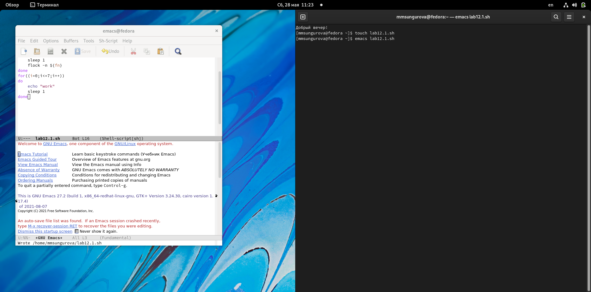
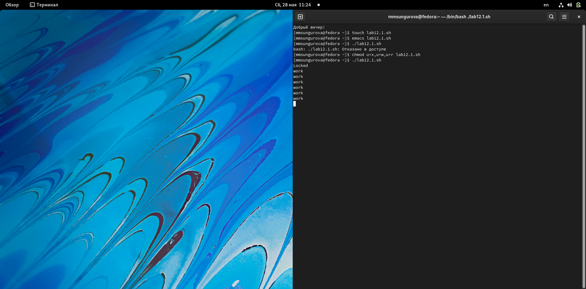
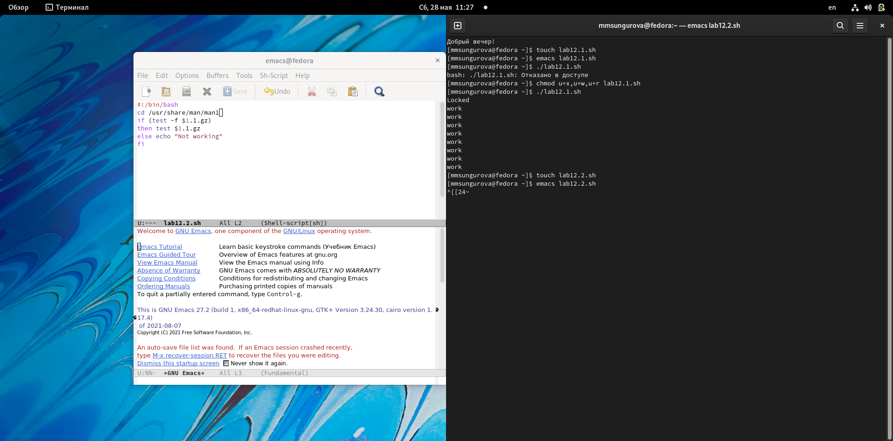
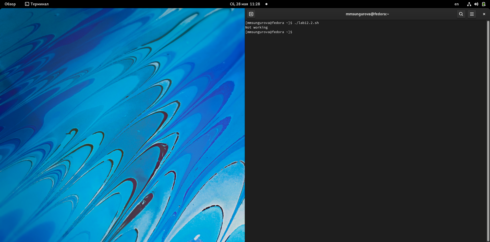
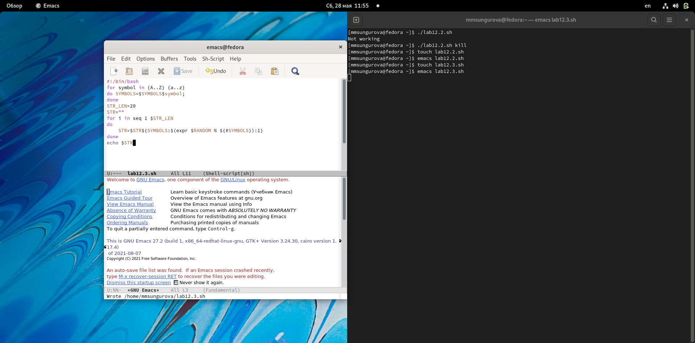
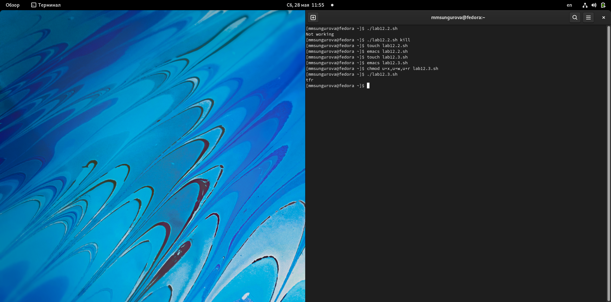

---
## Front matter
title: "Лабораторная работа №12"
subtitle: "Программирование в командном
процессоре ОС UNIX. Расширенное программирование"
author: "Сунгурова Мариян Мухсиновна"

## Generic otions
lang: ru-RU
toc-title: "Содержание"

## Bibliography
bibliography: bib/cite.bib
csl: pandoc/csl/gost-r-7-0-5-2008-numeric.csl

## Pdf output format
toc: true # Table of contents
toc-depth: 2
lof: true # List of figures
lot: false # List of tables
fontsize: 12pt
linestretch: 1.5
papersize: a4
documentclass: scrreprt
## I18n polyglossia
polyglossia-lang:
  name: russian
  options:
	- spelling=modern
	- babelshorthands=true
polyglossia-otherlangs:
  name: english
## I18n babel
babel-lang: russian
babel-otherlangs: english
## Fonts
mainfont: PT Serif
romanfont: PT Serif
sansfont: PT Sans
monofont: PT Mono
mainfontoptions: Ligatures=TeX
romanfontoptions: Ligatures=TeX
sansfontoptions: Ligatures=TeX,Scale=MatchLowercase
monofontoptions: Scale=MatchLowercase,Scale=0.9
## Biblatex
biblatex: true
biblio-style: "gost-numeric"
biblatexoptions:
  - parentracker=true
  - backend=biber
  - hyperref=auto
  - language=auto
  - autolang=other*
  - citestyle=gost-numeric
## Pandoc-crossref LaTeX customization
figureTitle: "Рис."
tableTitle: "Таблица"
listingTitle: "Листинг"
lofTitle: "Список иллюстраций"
lotTitle: "Список таблиц"
lolTitle: "Листинги"
## Misc options
indent: true
header-includes:
  - \usepackage{indentfirst}
  - \usepackage{float} # keep figures where there are in the text
  - \floatplacement{figure}{H} # keep figures where there are in the text
---

# Цель работы

Изучить основы программирования в оболочке ОС UNIX. Научиться писать более
сложные командные файлы с использованием логических управляющих конструкций
и циклов.

# Задание

1. Написать командный файл, реализующий упрощённый механизм семафоров. Ко-
мандный файл должен в течение некоторого времени t1 дожидаться освобождения
ресурса, выдавая об этом сообщение, а дождавшись его освобождения, использовать
его в течение некоторого времени t2<>t1, также выдавая информацию о том, что
ресурс используется соответствующим командным файлом (процессом). Запустить
командный файл в одном виртуальном терминале в фоновом режиме, перенаправив
его вывод в другой (> /dev/tty#, где # — номер терминала куда перенаправляется
вывод), в котором также запущен этот файл, но не фоновом, а в привилегированном
режиме. Доработать программу так, чтобы имелась возможность взаимодействия трёх
и более процессов.
2. Реализовать команду man с помощью командного файла. Изучите содержимое ката-
лога /usr/share/man/man1. В нем находятся архивы текстовых файлов, содержащих
справку по большинству установленных в системе программ и команд. Каждый архив
можно открыть командой less сразу же просмотрев содержимое справки. Командный
файл должен получать в виде аргумента командной строки название команды и в виде
результата выдавать справку об этой команде или сообщение об отсутствии справки,
если соответствующего файла нет в каталоге man1.
3. Используя встроенную переменную $RANDOM, напишите командный файл, генерирую-
щий случайную последовательность букв латинского алфавита. Учтите, что $RANDOM
выдаёт псевдослучайные числа в диапазоне от 0 до 32767.

# Теоретическое введение

Основная среда взаимодействия с UNIX — командная строка. Суть её в том, что каждая строка, передаваемая пользователем системе, — это команда, которую та должна выполнить.
Более подробно об Unix см. в [@gnu-doc:bash;@newham:2005:bash;@zarrelli:2017:bash;@robbins:2013:bash;@tannenbaum:arch-pc:ru;@tannenbaum:modern-os:ru].

# Выполнение лабораторной работы

1. Написать командный файл, реализующий упрощённый механизм семафоров. Ко-
мандный файл должен в течение некоторого времени t1 дожидаться освобождения
ресурса, выдавая об этом сообщение, а дождавшись его освобождения, использовать
его в течение некоторого времени t2<>t1, также выдавая информацию о том, что
ресурс используется соответствующим командным файлом (процессом). Запустить
командный файл в одном виртуальном терминале в фоновом режиме, перенаправив
его вывод в другой (> /dev/tty#, где # — номер терминала куда перенаправляется
вывод), в котором также запущен этот файл, но не фоновом, а в привилегированном
режиме. Доработать программу так, чтобы имелась возможность взаимодействия трёх
и более процессов.(рис. [-@fig:001 ; -@fig:002])

{ #fig:001 width=70% }

{ #fig:002 width=70% }

2. Реализовать команду man с помощью командного файла. Изучите содержимое ката-
лога /usr/share/man/man1. В нем находятся архивы текстовых файлов, содержащих
справку по большинству установленных в системе программ и команд. Каждый архив
можно открыть командой less сразу же просмотрев содержимое справки. Командный
файл должен получать в виде аргумента командной строки название команды и в виде
результата выдавать справку об этой команде или сообщение об отсутствии справки,
если соответствующего файла нет в каталоге man1.(рис. [-@fig:003; -@fig:004])

{ #fig:003 width=70% }

{ #fig:004 width=70% }

3. Используя встроенную переменную $RANDOM, напишите командный файл, генерирую-
щий случайную последовательность букв латинского алфавита. Учтите, что $RANDOM
выдаёт псевдослучайные числа в диапазоне от 0 до 32767.(рис. [-@fig:006; -@fig:007])

{ #fig:006 width=70% }

{ #fig:007 width=70% }

# Выводы
В результате выполнения данной лабораторной работы я изучила основы программирования в оболочке ОС UNIX. Научилась писать более
сложные командные файлы с использованием логических управляющих конструкций
и циклов.

# Контрольные вопросы 
1. 
    

    $1 следует внести в кавычки.

2.  С помощью знака >,| можно объединить несколько строк в одну.

3.    Эта утилита выводит последовательность целых чисел с заданным шагом. Также можно реализовать с помощью утилиты jot.

4.    Результатом вычисления выражения $((10/3)) будет число 3.

5.    В zsh можно настроить отдельные сочетания клавиш так, как вам нравится. Использование истории команд в zsh ничем особенным не отличается от bash. Zsh очень удобен для повседневной работы и делает добрую половину рутины за вас. Но стоит обратить внимание на различия между этими двумя оболочками. Например, в zsh после for обязательно вставлять пробел, нумерация массивов в zsh начинается с 1, чего совершенно невозможно понять. Так, если вы используете shell для повседневной работы, исключающей написание скриптов, используйте zsh. Если вам часто приходится писать свои скрипты, только bash! Впрочем, можно комбинировать.

6.    Синтаксис конструкции for ((a=1; a <= LIMIT; a++)) верен.

7.    Язык bash и другие языки программирования:

a. Скорость работы программ на ассемблере может быть более 50% медленнее, чем программ на си/си++, скомпилированных с максимальной оптимизацией;

b. Скорость работы виртуальной ява-машины с байт-кодом часто превосходит скорость аппаратуры с кодами, получаемыми трансляторами с языков высокого уровня. Ява-машина уступает по скорости только ассемблеру и лучшим оптимизирующим трансляторам;

c. Скорость компиляции и исполнения программ на яваскрипт в популярных браузерах лишь в 2-3 раза уступает лучшим трансляторам и превосходит даже некоторые качественные компиляторы, безусловно намного (более чем в 10 раз) обгоняя большинство трансляторов других языков сценариев и подобных им по скорости исполнения программ;

d. Скорость кодов, генерируемых компилятором языка си фирмы Intel, оказалась заметно меньшей, чем компилятора GNU и иногда LLVM;

e. Скорость ассемблерных кодов x86-64 может меньше, чем аналогичных кодов x86, примерно на 10%;

f. Оптимизация кодов лучше работает на процессоре Intel;

g. Скорость исполнения на процессоре Intel была почти всегда выше, за исключением языков лисп, эрланг, аук (gawk, mawk) и бэш. Разница в скорости по бэш скорее всего вызвана разными настройками окружения на тестируемых системах, а не собственно транслятором или железом. Преимущество Intel особенно заметно на 32-разрядных кодах;

h. Стек большинства тестируемых языков, в частности, ява и яваскрипт, поддерживают только очень ограниченное число рекурсивных вызовов. Некоторые трансляторы (gcc, icc, ...)

позволяют увеличить размер стека изменением переменных среды исполнения или параметром;

i. В рассматриваемых версиях gawk, php, perl, bash реализован динамический стек, позволяющий использовать всю память компьютера. Но perl и, особенно, bash используют стек настолько экстенсивно, что 8-16 ГБ не хватает для расчета ack(5,2,3)
# Список литературы{.unnumbered}

::: {#refs}
:::
