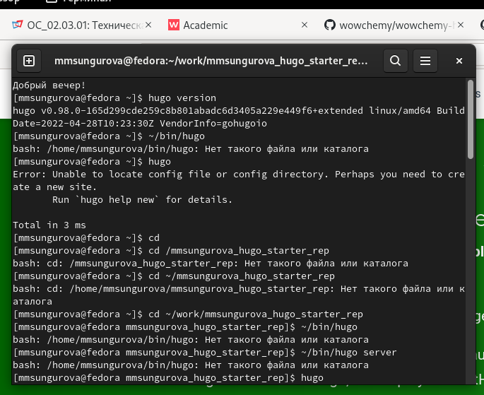
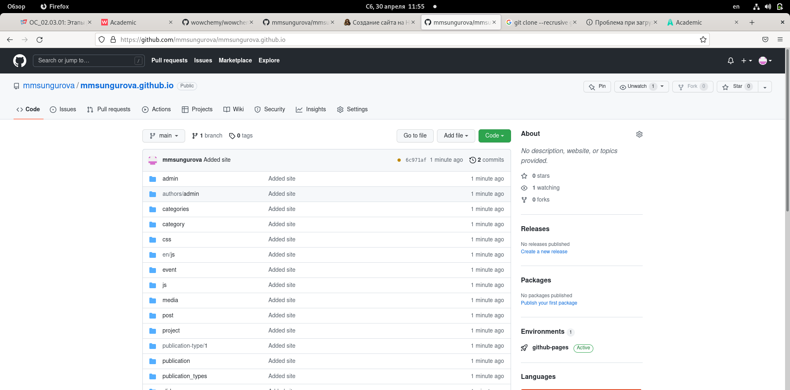
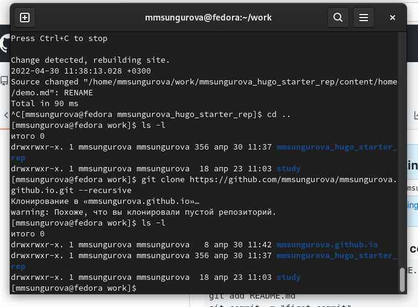
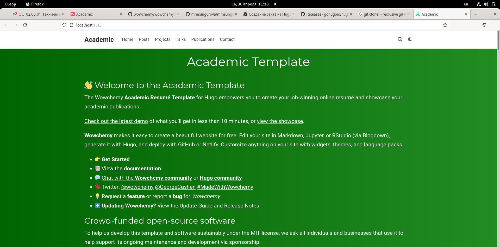
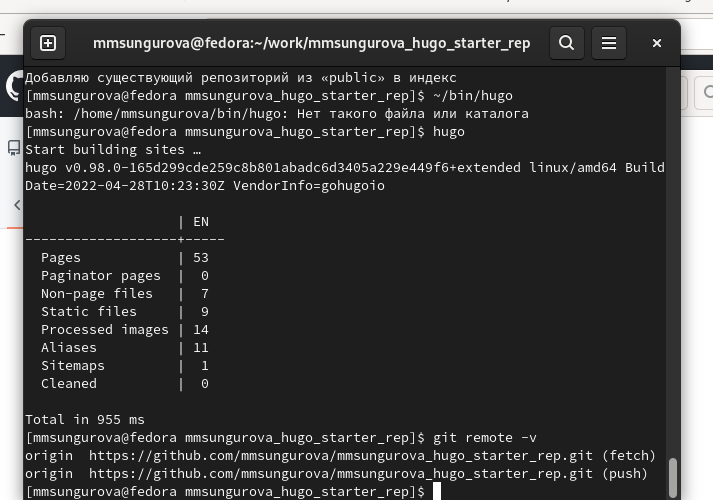

---
## Front matter
lang: ru-RU
title: Личный проект ШАГ №1
author: |
	Сунгурова Мариян Мухсиновна, НКНбд-01-21
	

## Formatting
toc: false
slide_level: 2
theme: metropolis
header-includes: 
 - \metroset{progressbar=frametitle,sectionpage=progressbar,numbering=fraction}
 - '\makeatletter'
 - '\beamer@ignorenonframefalse'
 - '\makeatother'
aspectratio: 43
section-titles: true
---

## Содержание
1. Цель работы
2. Процесс выполнения
3. Вывод
4. Источники

## Цель работы

Создать сайт с помощью генератора статического html Hugo и организовать быстрое развертывание сайта на GitHub Pages 

## Задание

- Установить необходимое программное обеспечение.
- Скачать шаблон темы сайта.
- Разместить его на хостинге git.
- Установить параметр для URLs сайта.
- Разместить заготовку сайта на Github pages.

## Процесс выполнения

1. Установила необходимое ПО (рис. [-@fig:001])

{ #fig:001 width=70% }

## Процесс выполнения

2. Скачала шаблон темы сайта с github (рис. [-@fig:002])

{ #fig:002 width=70% }

## Процесс выполнения

3. Разместила его на хостинге гит (рис. [-@fig:002])

## Процесс выполнения

4. Установила параметры для URLS сайта (рис. [-@fig:003])

{ #fig:003 width=70% }

## Процесс выполнения

5. Открыла сайт  (рис. [-@fig:004])

{ #fig:004 width=70% }

## Процесс выполнения

6. Разместила заготовку сайта на github pages (рис. [-@fig:005])

{ #fig:005 width=70% }

## Вывод
В процессе выполнения данного шага я получила навыки создания сайтов при помощи генератора статистического html hugo, а также их размещение на github pages.

## Иcточники

1. КулябовД. С. Введение в операционные системы –Лекция;

