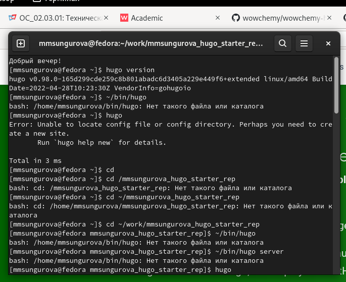
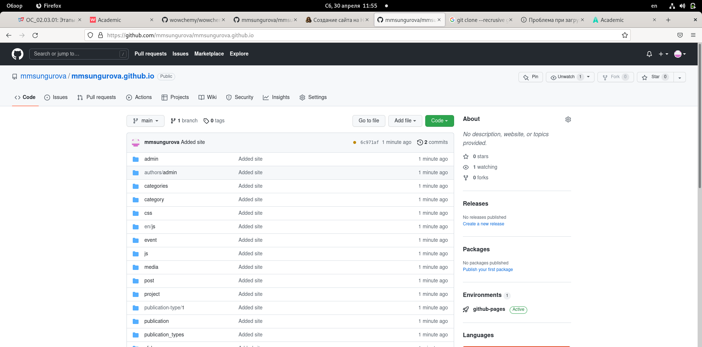
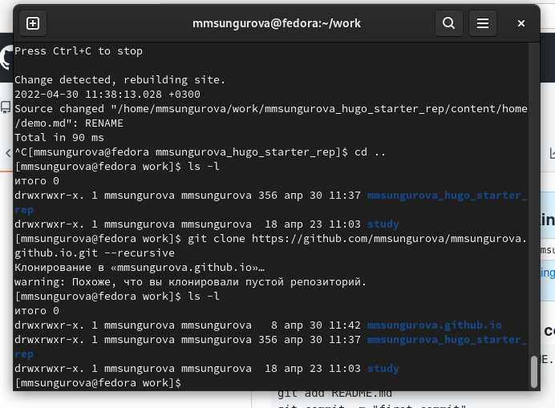
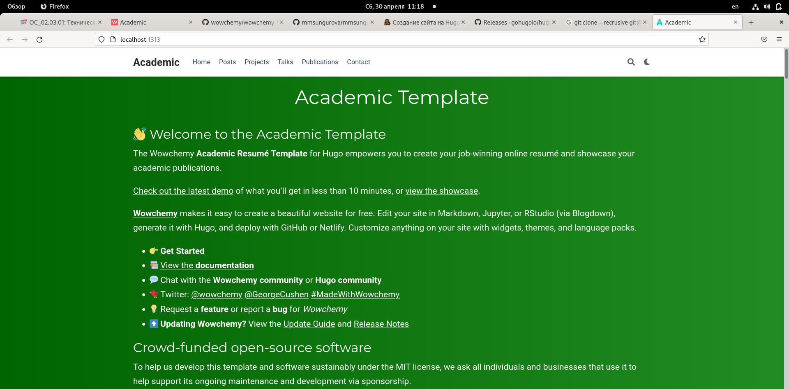

---
## Front matter
title: "Пресональный проект ШАГ №1"
subtitle: 
author: "Сунгурова Мариян Мухсиновна"

## Generic otions
lang: ru-RU
toc-title: "Содержание"

## Bibliography
bibliography: bib/cite.bib
csl: pandoc/csl/gost-r-7-0-5-2008-numeric.csl

## Pdf output format
toc: true # Table of contents
toc-depth: 2
lof: true # List of figures
lot: false # List of tables
fontsize: 12pt
linestretch: 1.5
papersize: a4
documentclass: scrreprt
## I18n polyglossia
polyglossia-lang:
  name: russian
  options:
	- spelling=modern
	- babelshorthands=true
polyglossia-otherlangs:
  name: english
## I18n babel
babel-lang: russian
babel-otherlangs: english
## Fonts
mainfont: PT Serif
romanfont: PT Serif
sansfont: PT Sans
monofont: PT Mono
mainfontoptions: Ligatures=TeX
romanfontoptions: Ligatures=TeX
sansfontoptions: Ligatures=TeX,Scale=MatchLowercase
monofontoptions: Scale=MatchLowercase,Scale=0.9
## Biblatex
biblatex: true
biblio-style: "gost-numeric"
biblatexoptions:
  - parentracker=true
  - backend=biber
  - hyperref=auto
  - language=auto
  - autolang=other*
  - citestyle=gost-numeric
## Pandoc-crossref LaTeX customization
figureTitle: "Рис."
tableTitle: "Таблица"
listingTitle: "Листинг"
lofTitle: "Список иллюстраций"
lotTitle: "Список таблиц"
lolTitle: "Листинги"
## Misc options
indent: true
header-includes:
  - \usepackage{indentfirst}
  - \usepackage{float} # keep figures where there are in the text
  - \floatplacement{figure}{H} # keep figures where there are in the text
---

# Цель работы

Создать сайт с помощью генератора статического html Hugo и организовать быстрое развертывание сайта на GitHub Pages 

# Задание

- Установить необходимое программное обеспечение.
- Скачать шаблон темы сайта.
- Разместить его на хостинге git.
- Установить параметр для URLs сайта.
- Разместить заготовку сайта на Github pages.

# Теоретическое введение

Сайт, или веб-сайт, также веб-узел, — одна или несколько логически связанных между собой веб-страниц; также место расположения контента сервера. Обычно сайт в Интернете представляет собой массив связанных данных, имеющий уникальный адрес и воспринимаемый пользователями как единое целое.

# Выполнение лабораторной работы

1. Установила необходимое ПО (рис. [-@fig:001])

{ #fig:001 width=70% }

2. Скачала шаблон темы сайта с github (рис. [-@fig:002])

{ #fig:002 width=70% }

2. Разместила его на хостинге гит (рис. [-@fig:002])

4. Установила параметры для URLS сайта (рис. [-@fig:003])

{ #fig:003 width=70% }

1. Открыла сайт  (рис. [-@fig:004])

{ #fig:004 width=70% }

1. Разместила заготовку сайта на github pages (рис. [-@fig:005])

{ #fig:005 width=70% }

# Выводы

В процессе выполнения данного шага я получила навыки создания сайтов при помощи генератора статистического html hugo, а также их размещение на github pages.

# Список литературы{.unnumbered}

::: {#refs}
:::
